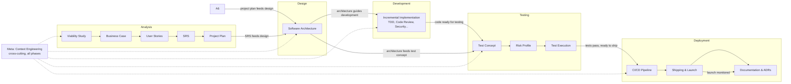

# Dark Software Factory — Skill & Template Guide

Comprehensive documentation for every skill and template in the Dark Software Factory, organized by SDLC phase. Each phase section includes a complete workflow explanation and a flow diagram showing all conditions and decision branches.

---

## How This Guide Is Organized

The Dark Software Factory contains **31 skills** and **14 templates** across **5 SDLC phases and 1 cross-cutting category**. Skills are the stable, repeatable workflows; templates are the per-customer customization points that define output structure and semantics.

| Phase | Skills | Templates | Guide |
|-------|-------:|----------:|-------|
| Analysis | 9 | 6 | [Analysis Guide](analysis.md) |
| Design | 1 | 1 | [Design Guide](design.md) |
| Development | 13 | 0 | [Development Guide](development.md) |
| Testing | 4 | 7 | [Testing Guide](testing.md) |
| Deployment | 3 | 0 | [Deployment Guide](deployment.md) |
| Meta (cross-cutting) | 1 | 0 | [Meta Guide](meta.md) |
| **Total** | **31** | **14** | |

> **Note:** A sixth phase, `intake`, is defined in the factory rules but has no skills or templates yet. It is planned as an upstream phase that runs before analysis. See the analysis guide for the proposed intake-to-analysis handoff.

> **Source of truth:** The root `README.md` maintains a quick-reference list of all skills and templates. This guide provides the authoritative detailed documentation for each, including workflows and flow diagrams. If the two ever disagree, this guide is authoritative.

---

## Skill Types

| Type | Prefix | Purpose | Template? |
|------|--------|---------|-----------|
| Orchestrator | `execute-*` | Runs a complete SDLC phase end-to-end, chaining sub-skills with quality gates | No |
| Generator | `generate-*` | Produces a single SDLC artifact by populating a template section-by-section | Yes — references `templates/<phase>/<artifact>.md` |
| Utility | (other) | A focused workflow or engineering practice, invoked independently or by an orchestrator | No |

---

## Master SDLC Workflow

The diagram below shows how the phases connect. Each phase produces deliverables that feed the next, and traceability is maintained backward through the entire chain.

---

## Traceability Chain

Every deliverable traces backward through the chain. A broken link means incomplete analysis and must be resolved before closing a phase. See the [Analysis Guide](analysis.md#traceability-chain-analysis) for the full chain.

---

## How to Use This Guide

1. **Read the phase guide** for the phase you are working in (links in the table above).
2. **Follow the workflow diagram** — it shows every decision branch and quality gate.
3. **Invoke individual skills** when you need a specific artifact, or use the `execute-*` orchestrator to run a full phase end-to-end.
4. **Customize templates** for your project context — templates live in `templates/<phase>/` and are the per-customer adaptation point.
5. **Check traceability** — ensure every output links backward to its source.
