# Analysis Phase Guide

The analysis phase determines **whether** a project should proceed and **what** it should produce. It is the deepest phase in the factory, with 9 skills, 6 templates, and an orchestrator that chains them through a 9-stage pipeline with quality gates and backward traceability.

---

## Phase Overview

| Component | Count | Details |
|-----------|------:|---------|
| Orchestrator | 1 | `execute-analysis-phase` |
| Generators | 6 | viability study, business case, project scope, user stories, SRS, project plan |
| Utilities | 2 | `idea-refine`, `interview-me` |
| Templates | 6 | `templates/analysis/*.md` |

The analysis phase answers three questions in order:
1. **Should we proceed?** (viability study → business case)
2. **What will we build?** (project scope → user stories → SRS)
3. **How will we deliver it?** (project plan)

---

## The 9-Stage Analysis Workflow

The `execute-analysis-phase` skill orchestrates a 9-stage pipeline. Each stage has a quality gate that must pass before advancing. Backtracking is expected and governed — when a later stage discovers a problem in an earlier stage, the pipeline returns to that stage, re-runs it, and propagates changes forward.

### Stage 1: Documentation Check & Intake
Catalog all available project documentation (specs, code, stakeholder inputs, existing artifacts). No assumptions are invented — only what exists is inventoried.

**Quality Gate 1:** Is the documentation inventory complete (all available sources cataloged)?

### Stage 2: Deep Documentation Analysis
Read, classify, and understand every document. Produce a Project Understanding Statement. Classify the project type: 🟢 Green Field, 🟤 Brown Field, or 🔵 Software Modernization.

**Quality Gate 2:** Is the Project Understanding Statement complete (every document read, project type classified)?

### Stage 3: Gap & Contradiction Analysis
Identify missing information and contradictions between sources. Produce a Gap & Contradiction Register with severity labels (Critical / Important / Optional).

**Quality Gate 3:** Is the Gap Register complete?

### Stage 4: Gap Resolution via Interview
If critical gaps exist, invoke the `interview-me` skill for one-question-at-a-time interviewing with attached guesses. Continue until critical gaps are resolved or explicitly deferred.

**Quality Gate 4:** Are all critical gaps resolved or explicitly deferred with stakeholder sign-off?

### Stage 5: Idea Refinement
Invoke the `idea-refine` skill to stress-test the concept through divergent (expand options) and convergent (evaluate, cluster, sharpen) thinking. Produce a Refined Project Concept one-pager.

**Quality Gate 5:** Is the refined concept agreed (explicit user "yes" on the recommended direction)?

> **Backtracking rule:** If Stage 5 reveals a fundamental misunderstanding, return to Stage 2 (re-analyze documentation with the new insight).

### Stage 6: Viability Study
Invoke `generate-viability-study` to determine whether the project should proceed at all. Assesses technical, economic, organizational, market, and risk feasibility.

**Quality Gate 6:** What is the decision? **Go** → continue. **No-Go** → stop. **Proceed-with-conditions** → return to Stage 4 (resolve the conditions via interview).

> **Backtracking rule:** If Stage 6 surfaces new gaps, return to Stage 4.

### Stage 7: Business Case
Invoke `generate-business-case` to build the investment case: options analysis (including "Do Nothing" baseline), financial modeling (NPV, IRR, payback, sensitivity), and a defensible recommendation.

**Quality Gate 7:** Is the investment decision made (option selected, budget approved)?

> **Backtracking rule:** If Stage 7 challenges the concept, return to Stage 5 (re-refine).

### Stage 8a: User Stories
Invoke `generate-user-stories` to decompose requirements into estimable, testable user stories organized by epics, mapped to releases.

**Quality Gate 8a:** Are user stories accepted (complete, estimable, traced to business case objectives)?

> **Backtracking rule:** If Stage 8a reveals business-case gaps, return to Stage 7.

### Stage 8b: SRS (Software Requirements Specification)
Invoke `generate-software-requirements-specification` to specify WHAT the system must do (not HOW): functional requirements, NFRs, use cases, business rules, data requirements, with full traceability to user stories.

**Quality Gate 8b:** Is the SRS complete and traceable (every requirement traces to a user story)?

> **Backtracking rule:** If Stage 8b reveals story gaps, return to Stage 8a.

### Stage 9: Project Plan
Invoke `generate-project-plan` to define HOW the project is executed: schedule, budget, resources, quality strategy, risk management, governance, deployment strategy.

**Quality Gate 9:** Is the plan complete and is the full traceability chain intact?

> **Backtracking rule:** If Stage 9 reveals SRS gaps, return to Stage 8b.

---

## Analysis Workflow Diagram

```mermaid
flowchart TD
    Start([Start: user requests analysis]) --> S1

    S1["Stage 1: Documentation Check & Intake<br/>Catalog all available project info"] --> QG1{"Quality Gate 1:<br/>Documentation inventory<br/>complete?"}
    QG1 -- "No — keep gathering" --> S1
    QG1 -- Yes --> S2

    S2["Stage 2: Deep Documentation Analysis<br/>Read, classify, understand all docs<br/>Classify project type: 🟢🟤🔵"] --> QG2{"Quality Gate 2:<br/>Project Understanding<br/>Statement complete?"}
    QG2 -- "No — keep analyzing" --> S2
    QG2 -- Yes --> S3

    S3["Stage 3: Gap & Contradiction Analysis<br/>Identify missing/contradictory info"] --> QG3{"Quality Gate 3:<br/>Gap Register<br/>complete?"}
    QG3 -- "No — keep analyzing" --> S3
    QG3 -- Yes --> QG3b{"Critical gaps<br/>exist?"}

    QG3b -- Yes --> S4["Stage 4: Gap Resolution via Interview<br/>Invoke interview-me skill<br/>One question at a time, with guesses"]
    QG3b -- "No — gaps are minor" --> S5

    S4 --> QG4{"Quality Gate 4:<br/>Critical gaps resolved<br/>or deferred?"}
    QG4 -- "No — more interviewing needed" --> S4
    QG4 -- Yes --> S5

    S5["Stage 5: Idea Refinement<br/>Invoke idea-refine skill<br/>Diverge → Converge → Sharpen"] --> QG5{"Quality Gate 5:<br/>Refined concept<br/>agreed?"}
    QG5 -- "No — concept needs rework" --> S5
    QG5 -- "Discovery: revisit understanding" --> S2
    QG5 -- Yes --> S6

    S6["Stage 6: Viability Study<br/>Invoke generate-viability-study<br/>Technical/economic/org/market/risk feasibility"] --> QG6{"Quality Gate 6:<br/>Go / No-Go<br/>decision?"}
    QG6 -- "No-Go" --> Stop([Stop: project not viable])
    QG6 -- "Proceed-with-conditions" --> S4
    QG6 -- Go --> S7

    S7["Stage 7: Business Case<br/>Invoke generate-business-case<br/>Options analysis + financial model"] --> QG7{"Quality Gate 7:<br/>Investment decision<br/>made?"}
    QG7 -- "Discovery: revisit concept" --> S5
    QG7 -- Yes --> S8a

    S8a["Stage 8a: User Stories<br/>Invoke generate-user-stories<br/>Epics → stories → acceptance criteria"] --> QG8a{"Quality Gate 8a:<br/>Stories accepted?"}
    QG8a -- "Discovery: revisit business case" --> S7
    QG8a -- Yes --> S8b

    S8b["Stage 8b: SRS<br/>Invoke generate-software-requirements-specification<br/>Functional + non-functional requirements"] --> QG8b{"Quality Gate 8b:<br/>SRS complete &<br/>traceable?"}
    QG8b -- "No — story gaps found" --> S8a
    QG8b -- Yes --> S9

    S9["Stage 9: Project Plan<br/>Invoke generate-project-plan<br/>Schedule, budget, resources, governance"] --> QG9{"Quality Gate 9:<br/>Plan complete &<br/>traceability intact?"}
    QG9 -- "Discovery: revisit SRS" --> S8b
    QG9 -- Yes --> Done([Complete: full analysis<br/>deliverables produced])

    style Stop fill:#f96,stroke:#c00,stroke-width:2px
    style Done fill:#9f9,stroke:#060,stroke-width:2px
```



---

## Skills

### 1. execute-analysis-phase (Orchestrator)

| Field | Value |
|-------|-------|
| Type | Orchestrator (`execute-*`) |
| Template | None (chains sub-skills) |
| Path | `skills/analysis/execute-analysis-phase/` |

Orchestrates the complete analysis phase by chaining documentation review, gap analysis, idea refinement, viability study, business case, user stories, requirements specification, and project plan generation. The 9-stage pipeline (documented above) has quality gates at each stage and governed backtracking.

**When to use:** Starting a new software project, when a user says "analyze my project", "run the analysis phase", "start project analysis", or when the full analysis pipeline needs to be executed from documentation through to project plan.

---

### 2. generate-viability-study (Generator)

| Field | Value |
|-------|-------|
| Type | Generator (`generate-*`) |
| Template | `templates/analysis/viability-study.md` (v2.0, 15 sections) |
| Path | `skills/analysis/generate-viability-study/` |

Generates the **first formal analysis document** — determines whether a project should proceed. Assesses current system, market & demand, technical feasibility, security & compliance, financial/economic viability, operational viability, quality & testing strategy, stakeholder analysis, risk, SWOT, alternatives, and go/no-go recommendations.

**When to use:** After documentation analysis and gap resolution, when you need to determine if a project is worth investing in.

**Output:** `documentation/viability-study.md` — a proceed / proceed-with-conditions / do-not-proceed decision with evidence.

---

### 3. generate-business-case (Generator)

| Field | Value |
|-------|-------|
| Type | Generator (`generate-*`) |
| Template | `templates/analysis/business-case.md` (v1.0, 17 sections) |
| Path | `skills/analysis/generate-business-case/` |

Generates an investment-grade Business Case. Conducts financial and strategic analysis, evaluates multiple options (including a "Do Nothing" baseline) against measurable criteria, models NPV/IRR/payback/BCR with sensitivity analysis, and presents a defensible investment recommendation.

**When to use:** After the viability study (if one exists), to answer "Should we invest, how much, and in which option?"

**Output:** `documentation/business-case.md` — the recommended option with full financial justification.

---

### 4. generate-project-scope (Generator)

| Field | Value |
|-------|-------|
| Type | Generator (`generate-*`) |
| Template | `templates/analysis/project-scope.md` (v1.0, 16 sections) |
| Path | `skills/analysis/generate-project-scope/` |

Generates the baselined scope document. Translates the approved option into delivery boundaries: scope statement, in-scope items (MoSCoW), scope-by-phase, functional requirements, NFRs, system boundaries, deliverables, WBS, acceptance criteria & Definition of Done, scope exclusions, and scope change control.

**When to use:** After the business case, to define what is and is not included in the project.

**Output:** `documentation/project-scope.md` — the baselined scope with MoSCoW priorities and traceability matrix.

---

### 5. generate-user-stories (Generator)

| Field | Value |
|-------|-------|
| Type | Generator (`generate-*`) |
| Template | `templates/analysis/user-stories.md` (v1.0, 13 sections) |
| Path | `skills/analysis/generate-user-stories/` |

Generates a central User Stories overview document AND individual per-story documents. Decomposes requirements into well-structured, estimable, testable user stories organized by epics, with Given/When/Then acceptance criteria, NFR attributes, dependency/sequencing, estimation & velocity, DoR/DoD, and story-splitting guidance.

**When to use:** After the business case, to translate "what the system must do" into "what users need, in what order, and how to deliver incrementally."

**Output:** `documentation/user-stories.md` (overview) + `documentation/user-stories/US-XXX.md` (one per story).

---

### 6. generate-software-requirements-specification (Generator)

| Field | Value |
|-------|-------|
| Type | Generator (`generate-*`) |
| Template | `templates/analysis/software-requirements-specification.md` (v1.0, 17 sections) |
| Path | `skills/analysis/generate-software-requirements-specification/` |

Generates a rigorous SRS specifying WHAT the system must do (not HOW). Covers stakeholders/personas/actors, functional requirements, use cases, business rules & decision logic, data requirements, interface requirements, NFRs, security & compliance, migration & transition requirements, constraints, and full requirement traceability to user stories.

**When to use:** After user stories, to produce the authoritative requirements document with singular, unambiguous, testable, traceable requirements.

**Output:** `documentation/software-requirements-specification.md`.

---

### 7. generate-project-plan (Generator)

| Field | Value |
|-------|-------|
| Type | Generator (`generate-*`) |
| Template | `templates/analysis/project-plan.md` (v1.0, 20 sections) |
| Path | `skills/analysis/generate-project-plan/` |

Generates the authoritative execution document — defines HOW the project will be executed, monitored, and controlled. Covers schedule/timeline, budget, quality strategy, risk management, communication, resources, procurement/vendors, scope change control, issue management, stakeholder management, transition & migration, deployment/release strategy, and project closeout.

**When to use:** As the final analysis deliverable, translating the "what and why" into "how, when, by whom, with what resources, under what governance."

**Output:** `documentation/project-plan.md`.

---

### 8. idea-refine (Utility)

| Field | Value |
|-------|-------|
| Type | Utility |
| Template | None (uses bundled assets: `frameworks.md`, `refinement-criteria.md`, `examples.md`) |
| Path | `skills/analysis/idea-refine/` |

Refines raw ideas into sharp, actionable concepts through a 3-phase process:
1. **Understand & Expand** — restate as "How Might We", apply 7 lenses (inversion, constraint removal, audience shift, combination, simplification, 10x, expert lens) to generate 5-8 variations.
2. **Evaluate & Converge** — cluster into 2-3 directions, stress-test on user value/feasibility/differentiation, surface hidden assumptions.
3. **Sharpen & Ship** — produce a one-pager: Problem Statement, Recommended Direction, Key Assumptions, MVP Scope, Not-Doing list, Open Questions.

**When to use:** When an idea is still vague, when you need to stress-test assumptions before committing, or when you want to expand options before converging.

**Output:** `documentation/ideas/[idea-name].md` — a one-page refined concept.

---

### 9. interview-me (Utility)

| Field | Value |
|-------|-------|
| Type | Utility |
| Template | None |
| Path | `skills/analysis/interview-me/` |

Extracts what the user actually wants instead of what they think they should want. Achieves this through one-question-at-a-time interviewing with attached guesses, looping until ~95% confidence and an explicit user "yes" on a concrete restatement.

The 5-step process:
1. **Hypothesize** — form a 0-100% confidence hypothesis (sub-70% must include a reason).
2. **Ask one question** with a guess attached, wait for reaction.
3. **Listen** for "want vs should want" divergence.
4. **Restate intent** in the user's words (Outcome / User / Why now / Success / Constraint / Out of scope).
5. **Confirm** — explicit "yes" only. Stop when the agent can predict the user's reaction to the next 3 questions.

**When to use:** When an ask is underspecified ("build me X" without "for whom" or "why now"), when the user explicitly invokes it ("interview me", "grill me", "are we sure?"), or when you catch yourself silently filling in ambiguous requirements.

**Output:** `documentation/intent/[topic].md` (optional) — the confirmed intent statement.

---

## Templates

All templates live in `templates/analysis/` and are referenced by their corresponding `generate-*` skill. Each template follows a consistent structure: Metadata → Table of Contents → numbered sections → Appendices → Document History → Usage Guide. Templates use a project-type classification system (🟢 Green Field, 🟤 Brown Field, 🔵 Software Modernization) and a `[APPLICABLE]` / `[NOT APPLICABLE]` marking convention for sections that don't apply to the project type.

### templates/analysis/viability-study.md

**Version:** 2.0 | **Sections:** 15

Produces the first formal analysis document — determines whether a project should proceed. Covers current system assessment, market & demand analysis, technical feasibility, security & compliance, financial/economic viability, operational viability, quality & testing strategy, stakeholder analysis, risk assessment, SWOT, alternatives analysis, and recommendations & go/no-go criteria.

**Backed by:** `generate-viability-study`

---

### templates/analysis/business-case.md

**Version:** 1.0 | **Sections:** 17

Produces an investment-grade Business Case — options analysis (including "Do Nothing" baseline), financial modeling (NPV/IRR/payback/BCR/sensitivity), benefits & dis-benefits, CapEx/OpEx/TCO, risk assessment, implementation/resource/stakeholder/governance plan, and post-implementation review plan.

**Backed by:** `generate-business-case`

---

### templates/analysis/project-scope.md

**Version:** 1.0 | **Sections:** 16

Produces the baselined scope document — scope statement, in-scope items (MoSCoW), scope-by-phase, feature parity scope, functional requirements, NFRs, system boundaries/interfaces, data scope (including migration), deliverables, WBS, acceptance criteria & DoD, scope exclusions, assumptions/constraints/dependencies, and scope change control.

**Backed by:** `generate-project-scope`

---

### templates/analysis/user-stories.md

**Version:** 1.0 | **Sections:** 13

Produces the user-stories document — story map, epics, detailed user stories with Given/When/Then acceptance criteria, NFR attributes per story, dependency/sequencing, estimation & velocity, DoR/DoD, story-splitting guide, migration & transition stories, and story change control.

**Backed by:** `generate-user-stories`

---

### templates/analysis/software-requirements-specification.md

**Version:** 1.0 | **Sections:** 17

Produces the authoritative SRS — what the system must do: stakeholders/personas/actors, functional requirements, use cases, business rules & decision logic, data requirements, interface requirements, NFRs, security & compliance, migration & transition requirements, constraints/assumptions, requirement traceability, V&V, and change control. Uses ID prefixes: `FR-`, `NFR-`, `BR-`, `UC-`, `IR-`, `DR-`, `MR-`.

**Backed by:** `generate-software-requirements-specification`

---

### templates/analysis/project-plan.md

**Version:** 1.0 | **Sections:** 20

Produces the authoritative execution document — defines HOW the project is executed: schedule/timeline, budget, quality strategy, risk management, communication, resources, procurement/vendors, scope change control, issue management, stakeholder management, transition & migration plan, deployment/release strategy, and project closeout. Includes a pre-populated RACI matrix template.

**Backed by:** `generate-project-plan`

---

## Traceability Chain (Analysis)

The analysis phase enforces and preserves this backward traceability chain. Broken links = incomplete analysis; they must be flagged and resolved before closing the phase.

```
Project Plan work package
  → SRS requirement
    → User story
      → Business case objective
        → Viability study finding
          → Refined concept assumption
            → Original documentation / interview answer
```

---

## Proposed Intake Phase (Upstream)

A sixth phase, `intake`, is planned to run **before** analysis. It would gather all available information, filter to analysis-relevant items, identify gaps, interview downstream-project people, and produce a single **Project Intake Dossier** that every analysis skill consumes. This would shrink `execute-analysis-phase` Stage 1 to "consume the dossier" and eliminate duplicated information-gathering logic across the 6 generators. The intake phase has 0 artifacts today. The proposed design includes 4 new skills (`execute-intake-phase`, `generate-project-intake-dossier`, `discover-project-information`, `identify-interview-targets`) plus reuse of the existing `interview-me` skill, organized into a 7-stage pipeline: Discover → Filter → Structure → Gap Analysis → Stakeholder Mapping → Targeted Interviews → Produce Dossier.
