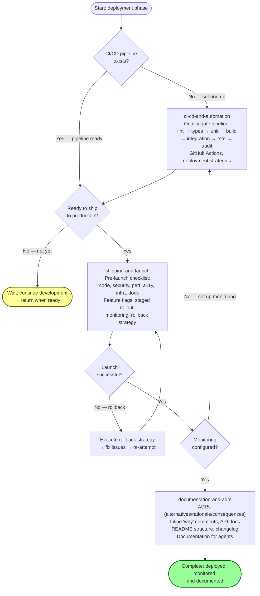
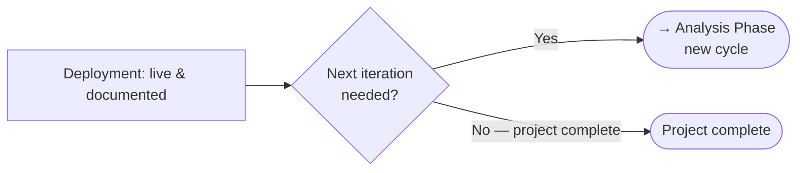

# Deployment Phase Guide

The deployment phase automates quality gates, ships to production, and records decisions for future engineers and agents. It has 3 utility skills covering CI/CD automation, shipping & launch, and documentation & ADRs. These skills compose into a deployment pipeline that runs from build automation through production launch and ongoing documentation.

---

## Phase Overview

| Component | Count | Details |
|-----------|------:|---------|
| Utilities | 3 | `ci-cd-and-automation`, `shipping-and-launch`, `documentation-and-adrs` |
| Templates | 0 | Deployment skills are workflow-based, not artifact-generating |

---

## The Deployment Workflow

The deployment phase has three stages that can overlap and iterate: **automate** (set up CI/CD), **ship** (launch safely), and **document** (record decisions).

### Stage 1: Automate (CI/CD Pipeline)
Invoke `ci-cd-and-automation` to set up the quality gate pipeline: lint → types → unit tests → build → integration tests → e2e tests → audit → bundle size. Configure GitHub Actions, deployment strategies (preview environments, feature flags, staged rollout, rollback), and environment management.

### Stage 2: Ship (Production Launch)
Invoke `shipping-and-launch` to prepare for production. Run the pre-launch checklist (code readiness, security, performance, accessibility, infrastructure, documentation), configure feature flag lifecycle, plan the staged rollout with decision thresholds, set up monitoring, and define the rollback strategy.

### Stage 3: Document (Decisions & Records)
Invoke `documentation-and-adrs` to record decisions: Architecture Decision Records (ADRs with alternatives/rationale/consequences), inline comments on "why", API documentation, README structure, changelog maintenance, and documentation specifically for agents.

---

## Deployment Workflow Diagram

---

## Skills

### 1. ci-cd-and-automation (Utility)

| Field | Value |
|-------|-------|
| Type | Utility |
| Path | `skills/deployment/ci-cd-and-automation/` |

Automates CI/CD pipeline setup and quality gates. The pipeline: lint → types → unit tests → build → integration tests → e2e tests → audit → bundle size. Covers GitHub Actions configuration, feeding CI failures back to agents, deployment strategies (preview environments, feature flags, staged rollout, rollback), environment management, automation beyond CI, and CI optimization.

**When to use:** Setting up or modifying build and deployment pipelines, automating quality gates, configuring test runners in CI, or establishing deployment strategies.

---

### 2. shipping-and-launch (Utility)

| Field | Value |
|-------|-------|
| Type | Utility |
| Path | `skills/deployment/shipping-and-launch/` |

Prepares production launches safely. The pre-launch checklist covers code readiness, security, performance, accessibility, infrastructure, and documentation. Includes feature flag lifecycle management, staged rollout with decision thresholds, monitoring & observability setup, and rollback strategy. References `references/security-checklist.md`, `references/performance-checklist.md`, and `references/accessibility-checklist.md`.

**When to use:** Preparing to deploy to production, when you need a pre-launch checklist, when setting up monitoring, planning a staged rollout, or defining a rollback strategy.

---

### 3. documentation-and-adrs (Utility)

| Field | Value |
|-------|-------|
| Type | Utility |
| Path | `skills/deployment/documentation-and-adrs/` |

Records decisions and documentation. Covers Architecture Decision Records (ADRs with alternatives, rationale, consequences), inline documentation (comments on "why", not "what"), API documentation, README structure, changelog maintenance, and documentation specifically designed for agents working in the codebase.

**When to use:** Making architectural decisions, changing public APIs, shipping features, or when you need to record context that future engineers and agents will need to understand the codebase.

---

## References Used

| Reference | Used by |
|-----------|---------|
| `references/security-checklist.md` | `shipping-and-launch` |
| `references/performance-checklist.md` | `shipping-and-launch` |
| `references/accessibility-checklist.md` | `shipping-and-launch` |

---

## Complete SDLC Handoff

The deployment phase is the final SDLC phase. After deployment, the cycle can restart with new analysis for the next iteration.

