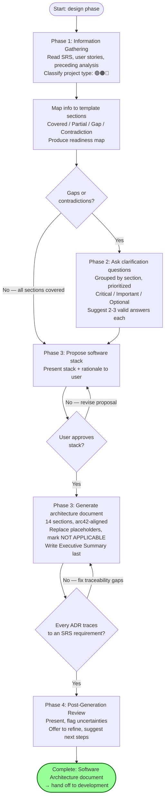
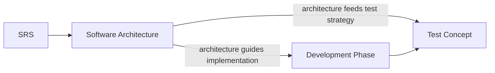

# Design Phase Guide

The design phase translates the SRS's "what the system must do" into "how the system will be built." It produces a single artifact: the Software Architecture document, which specifies concrete technology choices, decomposition strategies, runtime behaviors, deployment models, and cross-cutting concepts.

---

## Phase Overview

| Component | Count | Details |
|-----------|------:|---------|
| Generators | 1 | `generate-software-architecture` |
| Templates | 1 | `templates/design/software-architecture.md` |
| External sources | 1 | `external_sources/arc42/` (arc42 template, reference) |

The design phase has one skill that follows a 4-phase generator workflow, uniquely **proposes a software stack and aligns it with the user before finalizing**. The output document is arc42-aligned (12 canonical sections) and supports all project types: 🟢 Green Field, 🟤 Brown Field, 🔵 Software Modernization.

---

## The Design Workflow

The `generate-software-architecture` skill follows a 4-phase process shared by all generators in the factory, with one phase-unique step: stack proposal and user alignment.

### Phase 1: Information Gathering & Deep Analysis
Read the template, then discover and read all available project information — especially the SRS, user stories, and preceding analysis artifacts. Classify the project type (🟢/🟤/🔵). Map existing information to each template section as Covered / Partially Covered / Gap / Contradiction. Produce a readiness map.

### Phase 2: Clarification Questions
If gaps or contradictions exist, ask the user clarification questions grouped by template section, prioritized as [Critical] / [Important] / [Optional]. Suggest 2-3 valid answers for each to reduce user burden.

### Phase 3: Document Generation (with Stack Proposal)
**Unique to this skill:** before generating the full document, propose a software stack and align it with the user. Once the user approves the stack, follow the template section-by-section, replacing placeholders, marking [NOT APPLICABLE] sections with a one-line rationale, filling every table, and writing the Executive Summary last. Ensure every architectural decision traces to an SRS requirement.

### Phase 4: Post-Generation Review
Present the document, highlight key judgments and uncertainties, flag assumptions, offer to refine sections, and suggest next steps (typically: hand off to the development phase, or feed into the test concept).

---

## Design Workflow Diagram

---

## Skill

### generate-software-architecture (Generator)

| Field | Value |
|-------|-------|
| Type | Generator (`generate-*`) |
| Template | `templates/design/software-architecture.md` (v1.0, 14 sections) |
| Path | `skills/design/generate-software-architecture/` |
| External source | `external_sources/arc42/` (arc42 architecture template, used as upstream reference) |

Generates a Software Architecture document specifying HOW the system will be built. Translates the SRS's "what" into concrete technology choices, decomposition strategies (building block views L1/L2/L3 + existing/transition blocks), runtime behaviors, deployment models, and cross-cutting concepts. Uniquely proposes a software stack and aligns it with the user before finalizing.

Covers all project types:
- 🟢 **Green Field** — new system, no legacy constraints
- 🟤 **Brown Field** — existing system, must coexist with current architecture
- 🔵 **Software Modernization** — migrate/replace an existing system (includes migration decision records)

**When to use:** After the SRS is complete, when you need to define the technology stack, component decomposition, runtime view, deployment view, and architectural decisions.

**Output:** `documentation/software-architecture.md` — a 14-section arc42-aligned architecture document with ADRs and quality scenarios.

---

## Template

### templates/design/software-architecture.md

**Version:** 1.0 | **Sections:** 14 (arc42-aligned)

Produces an arc42-style Software Architecture document. Uses the `\<Insert ... Diagram\>` placeholder convention for C4/UML/deployment/sequence diagrams, and embeds ADR sub-templates (`ADR-001` for architecture decisions, `ADR-M001` for migration decision records).

**Sections:**
1. Executive Summary
2. Introduction and Goals (requirements overview, quality goals, stakeholders)
3. Architecture Constraints
4. Context and Scope (business context, technical context)
5. Solution Strategy
6. Building Block View (L1/L2/L3 + existing/transition blocks)
7. Runtime View
8. Deployment View (infrastructure L1/L2)
9. Cross-cutting Concepts
10. Architecture Decisions (ADRs + migration decision records)
11. Quality Requirements (overview + quality scenarios)
12. Risks and Technical Debts
13. Glossary
14. Appendices

**Backed by:** `generate-software-architecture`

**Upstream reference:** `external_sources/arc42/arc42-template.md` — the canonical arc42 template (v9.0-EN, 1077 lines) with embedded guidance and reference diagrams. The factory's template is adapted from this upstream source.

---

## Handoff

The design phase feeds two downstream phases:

