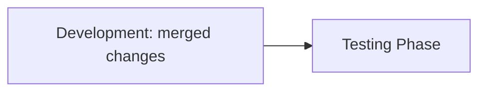

# Development Phase Guide

The development phase is the largest phase in the factory, with 13 skills covering the full engineering lifecycle: from specification and source-driven development through incremental implementation, testing, code review, security, performance, observability, and git workflow. These skills are **utilities** — they are invoked individually or composed into a development cycle, rather than chained by a single orchestrator.

---

## Phase Overview

| Component | Count | Details |
|-----------|------:|---------|
| Utilities | 13 | Engineering practice skills (no `execute-*` orchestrator, no templates) |
| Templates | 0 | Development skills are workflow-based, not artifact-generating |

The 13 skills are organized into four roles:

| Role | Skills | When invoked |
|------|-------|--------------|
| **Planning & Specification** | `spec-driven-development`, `source-driven-development` | Before writing code |
| **Implementation** | `incremental-implementation`, `test-driven-development`, `frontend-ui-engineering` | While writing code |
| **Quality & Review** | `code-review-and-quality`, `code-simplification`, `doubt-driven-development` | Before merging |
| **Infrastructure & Hardening** | `git-workflow-and-versioning`, `api-and-interface-design`, `observability-and-instrumentation`, `security-and-hardening`, `performance-optimization` | Throughout |

---

## The Development Cycle

The development skills form a cycle that repeats for every change. Not every skill is invoked every time — the diagram below shows the decision points that determine which skills apply.

```mermaid
flowchart TD
    Start([Start: feature/change requested]) --> SpecExists{"Spec exists?"}

    SpecExists -- "No — write one first" --> SDD["spec-driven-development<br/>SPECIFY → PLAN → TASKS → IMPLEMENT<br/>Gated workflow with human review"]
    SpecExists -- "Yes — proceed" --> UsingFramework{"Using a framework<br/>or library?"}

    UsingFramework -- Yes --> SrDD["source-driven-development<br/>DETECT → FETCH → IMPLEMENT → CITE<br/>Ground in official docs"]
    UsingFramework -- "No — vanilla code" --> Slice
    SDD --> Slice
    SrDD --> Slice["incremental-implementation<br/>Build in thin vertical slices<br/>implement → test → verify → commit"]

    Slice --> ChangeType{"What kind<br/>of change?"}

    ChangeType -- "Logic / bug fix" --> TDD["test-driven-development<br/>RED → GREEN → REFACTOR<br/>Prove-It pattern for bugs"]
    ChangeType -- "User-facing UI" --> FUI["frontend-ui-engineering<br/>Component architecture, state,<br/>design system, WCAG 2.1 AA"]
    ChangeType -- "Interface / API" --> AID["api-and-interface-design<br/>Stable, hard-to-misuse contracts<br/>Hyrum's Law, One-Version Rule"]

    TDD --> ReadyForReview
    FUI --> ReadyForReview
    AID --> ReadyForReview

    ReadyForReview["Code ready for review"] --> CRQ["code-review-and-quality<br/>Five-axis review:<br/>correctness, readability,<br/>architecture, security, performance"]

    CRQ --> ComplexityFound{"Complexity or<br/>readability issues?"}
    ComplexityFound -- Yes --> CS["code-simplification<br/>Reduce complexity<br/>while preserving behavior<br/>Chesterton's Fence"]
    ComplexityFound -- "No — code is clean" --> HighStakes
    CS --> HighStakes{"High-stakes decision?<br/>production, security,<br/>irreversible ops"}

    HighStakes -- Yes --> DDD["doubt-driven-development<br/>CLAIM → EXTRACT → DOUBT →<br/>RECONCILE → STOP<br/>Fresh-context adversarial review"]
    HighStakes -- "No — standard change" --> Security
    DDD --> Security

    Security["security-and-hardening<br/>Threat model first (STRIDE)<br/>Three-tier boundary system<br/>OWASP Top 10 + LLM Top 10"] --> PerfReqs{"Performance<br/>requirements exist?"}

    PerfReqs -- Yes --> PO["performance-optimimization<br/>Measure → Identify → Fix →<br/>Verify → Guard<br/>Core Web Vitals, N+1, caching"]
    PerfReqs -- "No — skip perf pass" --> Obs
    PO --> Obs["observability-and-instrumentation<br/>Structured logs, RED/USE metrics,<br/>OpenTelemetry tracing,<br/>symptom-based alerting"]

    Obs --> Commit["git-workflow-and-versioning<br/>Atomic commits, descriptive messages<br/>trunk-based, worktrees for parallel agents"]
    Commit --> Merged([Complete: change merged<br/>→ ready for testing phase])

    style Merged fill:#9f9,stroke:#060,stroke-width:2px
```

---

## Skills

### Planning & Specification

#### spec-driven-development (Utility)

| Field | Value |
|-------|-------|
| Type | Utility |
| Path | `skills/development/spec-driven-development/` |

Creates specs before coding through a gated workflow: **SPECIFY → PLAN → TASKS → IMPLEMENT**, with human review at each gate. Surfaces assumptions explicitly and reframes instructions as success criteria.

**When to use:** Starting a new project, feature, or significant change when no specification exists yet, or when requirements are unclear, ambiguous, or only a vague idea.

---

#### source-driven-development (Utility)

| Field | Value |
|-------|-------|
| Type | Utility |
| Path | `skills/development/source-driven-development/` |

Grounds every implementation decision in official documentation. The process: **DETECT** (what framework/pattern is in play) → **FETCH** (pull the official docs) → **IMPLEMENT** (follow the docs) → **CITE** (reference the source with full URLs). Maintains a source hierarchy, surfaces conflicts between sources, and flags unverifiable patterns.

**When to use:** Building with any framework or library where correctness matters, when you want authoritative, source-cited code free from outdated patterns.

---

### Implementation

#### incremental-implementation (Utility)

| Field | Value |
|-------|-------|
| Type | Utility |
| Path | `skills/development/incremental-implementation/` |

Delivers changes in thin vertical slices: **implement → test → verify → commit**, repeated. Simplicity-first, scope discipline, feature flags, rollback-friendly increments. Includes slicing strategies and working-with-agents guidance.

**When to use:** Implementing any feature or change that touches more than one file, or when a task feels too big to land in one step.

---

#### test-driven-development (Utility)

| Field | Value |
|-------|-------|
| Type | Utility |
| Path | `skills/development/test-driven-development/` |

Drives development with tests via the **RED → GREEN → REFACTOR** cycle. Includes the Prove-It pattern for bugs (write a failing test that reproduces the bug first). Test pyramid with resource model (small/medium/large tests). DAMP over DRY for test code. Browser testing with DevTools MCP and security boundaries.

**When to use:** Implementing any logic, fixing any bug, or changing any behavior. When you need to prove that code works, when a bug report arrives, or when modifying existing functionality.

---

#### frontend-ui-engineering (Utility)

| Field | Value |
|-------|-------|
| Type | Utility |
| Path | `skills/development/frontend-ui-engineering/` |

Builds production-quality UIs: component architecture, state management, design-system adherence, avoiding the "AI aesthetic", WCAG 2.1 AA accessibility, responsive design, loading/transitions. References `references/accessibility-checklist.md`.

**When to use:** Building or modifying user-facing interfaces, creating components, implementing layouts, managing state, or when the output needs to look and feel production-quality.

---

### Quality & Review

#### code-review-and-quality (Utility)

| Field | Value |
|-------|-------|
| Type | Utility |
| Path | `skills/development/code-review-and-quality/` |

Conducts multi-axis code review across five dimensions: correctness, readability, architecture, security, performance. Includes change sizing, severity labels, dead-code hygiene, dependency discipline, and a multi-model review pattern. References `references/security-checklist.md` and `references/performance-checklist.md`.

**When to use:** Before merging any change. When reviewing code written by yourself, another agent, or a human. When you need to assess code quality across multiple dimensions.

---

#### code-simplification (Utility)

| Field | Value |
|-------|-------|
| Type | Utility |
| Path | `skills/development/code-simplification/` |

Simplifies code by reducing complexity while preserving exact behavior. Five principles (including Chesterton's Fence — understand why code exists before removing it), clarity over cleverness, scope to what changed, with language-specific guidance.

**When to use:** Refactoring code for clarity without changing behavior, when code works but is harder to read/maintain/extend than it should be, or when reviewing code that accumulated unnecessary complexity.

---

#### doubt-driven-development (Utility)

| Field | Value |
|-------|-------|
| Type | Utility |
| Path | `skills/development/doubt-driven-development/` |

Subjects every non-trivial decision to a fresh-context adversarial review before it stands. The process: **CLAIM → EXTRACT → DOUBT → RECONCILE → STOP**. Spawns a fresh-context reviewer biased to disprove. Offers cross-model review (Gemini/Codex CLI) every interactive cycle. References `references/orchestration-patterns.md`.

**When to use:** When correctness matters more than speed, working in unfamiliar code, high stakes (production, security-sensitive logic, irreversible operations), or when a confident output would be cheaper to verify now than debug later.

---

### Infrastructure & Hardening

#### git-workflow-and-versioning (Utility)

| Field | Value |
|-------|-------|
| Type | Utility |
| Path | `skills/development/git-workflow-and-versioning/` |

Structures git workflow practices: trunk-based development, atomic commits, descriptive messages, short-lived feature branches, worktrees for parallel agents, and the save-point pattern. Includes pre-commit hygiene and using git for debugging.

**When to use:** Making any code change — committing, branching, resolving conflicts, or organizing work across multiple parallel streams.

---

#### api-and-interface-design (Utility)

| Field | Value |
|-------|-------|
| Type | Utility |
| Path | `skills/development/api-and-interface-design/` |

Guides stable API and interface design. Key principles: Hyrum's Law (every observable behavior becomes depended on), One-Version Rule, contract-first, validate at boundaries, addition over modification, predictable naming. Covers REST and GraphQL endpoints, TypeScript type contracts, and module boundaries.

**When to use:** Designing APIs, module boundaries, or any public interface. Creating REST/GraphQL endpoints, defining type contracts between modules, or establishing boundaries between frontend and backend.

---

#### observability-and-instrumentation (Utility)

| Field | Value |
|-------|-------|
| Type | Utility |
| Path | `skills/development/observability-and-instrumentation/` |

Instruments code so production behavior is visible and diagnosable: define on-call questions, structured logs with correlation IDs, RED/USE metrics, OpenTelemetry tracing, symptom-based alerting, and verifying the telemetry itself works.

**When to use:** Adding logging, metrics, tracing, or alerting. Shipping any feature that runs in production and you need evidence it works. When production issues are reported but you can't tell what happened from available data.

---

#### security-and-hardening (Utility)

| Field | Value |
|-------|-------|
| Type | Utility |
| Path | `skills/development/security-and-hardening/` |

Hardens code against vulnerabilities. Threat model first (STRIDE), three-tier boundary system, OWASP Top 10 prevention patterns, input validation, SSRF prevention, dependency hygiene, rate limiting, secrets management, and OWASP LLM Top 10 for AI features. References `references/security-checklist.md`.

**When to use:** Handling user input, authentication, data storage, or external integrations. Building any feature that accepts untrusted data, manages sessions, or interacts with third-party services.

---

#### performance-optimization (Utility)

| Field | Value |
|-------|-------|
| Type | Utility |
| Path | `skills/development/performance-optimization/` |

Optimizes application performance: **measure → identify → fix → verify → guard**. Core Web Vitals targets (LCP, INP, CLS), N+1 query detection, image optimization, caching, bundle budgets, and performance budgets. References `references/performance-checklist.md`.

**When to use:** When performance requirements exist, when you suspect regressions, when Core Web Vitals or load times need improvement, or when profiling reveals bottlenecks.

---

## References Used

The development skills reference these factory-level reference files:

| Reference | Used by |
|-----------|---------|
| `references/accessibility-checklist.md` | `frontend-ui-engineering` |
| `references/security-checklist.md` | `security-and-hardening`, `code-review-and-quality` |
| `references/performance-checklist.md` | `performance-optimization`, `code-review-and-quality` |
| `references/testing-patterns.md` | `test-driven-development` |
| `references/orchestration-patterns.md` | `doubt-driven-development` |

---

## Handoff

The development phase feeds the testing phase. Code that passes review and is merged becomes the input for test concept generation and test execution.

