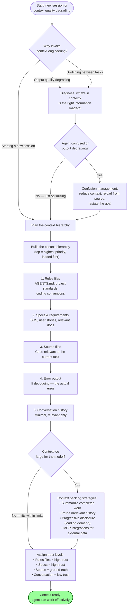
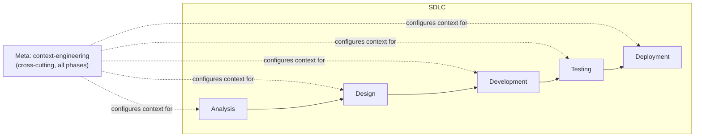

# Meta Phase Guide (Cross-Cutting)

The `meta` directory holds cross-cutting skills that are not specific to any single SDLC phase. These skills apply across the entire lifecycle and are invoked whenever their concern is relevant, regardless of which phase you are in.

---

## Phase Overview

| Component | Count | Details |
|-----------|------:|---------|
| Utilities | 1 | `context-engineering` |
| Templates | 0 | Meta skills are workflow-based |

> Per the factory rules, `meta` is **not an SDLC phase** — it is a directory for cross-cutting, non-phase-specific skills. Meta skills are listed separately from the SDLC phase pipeline.

---

## The Context Engineering Workflow

The `context-engineering` skill optimizes agent context setup. It curates what an agent sees in its context window deliberately, following a strict hierarchy: rules files → specs → source files → error output → conversation history. When context is too large, it applies packing strategies (summarize, prune, progressive disclosure) and leverages MCP integrations.

---

## Context Engineering Workflow Diagram

---

## Skill

### context-engineering (Utility, Cross-Cutting)

| Field | Value |
|-------|-------|
| Type | Utility |
| Path | `skills/meta/context-engineering/` |

Optimizes agent context setup by curating what the agent sees deliberately. The context hierarchy (in priority order):
1. **Rules files** — `AGENTS.md`, project standards, coding conventions (highest trust)
2. **Specs & requirements** — SRS, user stories, relevant documentation
3. **Source files** — code relevant to the current task (ground truth)
4. **Error output** — when debugging, the actual error output
5. **Conversation history** — minimal, relevant only (lowest trust)

Context packing strategies: summarize completed work, prune irrelevant history, progressive disclosure (load references on demand), and MCP integrations for external data. Confusion management: when the agent is confused or output degrades, reduce context, reload from source, and restate the goal.

**When to use:** Starting a new session, when agent output quality degrades, when switching between tasks, or when you need to configure rules files and context for a project. Cross-cutting — applies to all SDLC phases.

---

## How Meta Skills Relate to the SDLC

Context engineering is invoked at the **start of any session** or whenever output quality degrades during **any phase**. It is not part of the linear SDLC pipeline — it wraps around it, ensuring the agent always has the right information loaded for the task at hand.
