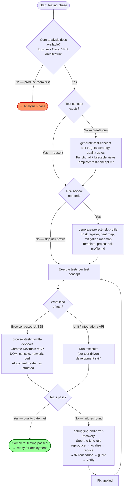
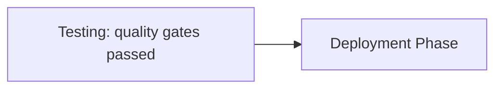

# Testing Phase Guide

The testing phase establishes the testing approach, identifies risks, and executes tests. It has 4 skills (2 generators for planning artifacts, 2 utilities for execution) and 7 templates. The phase covers both test **strategy** (what to test and how) and test **execution** (running tests and debugging failures).

---

## Phase Overview

| Component | Count | Details |
|-----------|------:|---------|
| Generators | 2 | `generate-test-concept`, `generate-project-risk-profile` |
| Utilities | 2 | `browser-testing-with-devtools`, `debugging-and-error-recovery` |
| Templates | 7 | `templates/testing/*.md` (2 backed by generators, 5 orphaned) |

> **Note on orphaned templates:** Five test-case templates exist (`functional`, `technical`, `non-functional`, `documentation`, `availability-live`) but have no corresponding `generate-*` skills. They are documented below for completeness and are candidates for future generator skills.

---

## The Testing Workflow

The testing phase has two stages: **planning** (produce the test concept and risk profile) and **execution** (run tests, debug failures, iterate).

### Stage 1: Test Planning
1. Invoke `generate-test-concept` to produce the overall test strategy: test targets (SUT, inventory, platforms, integrations), test levels, design techniques, automation, risk-based prioritization, quality gates, formal/regulatory requirements, and the Functional + Business Object Lifecycle views.
2. Invoke `generate-project-risk-profile` to produce the risk register, heat map, and mitigation roadmap by analyzing the Business Case, User Stories, SRS, and Architecture for risks, gaps, and contradictions.

### Stage 2: Test Execution
3. Execute tests according to the test concept. For browser-based testing, invoke `browser-testing-with-devtools` to inspect live browser state (DOM, console, network, performance, visual output) via Chrome DevTools MCP.
4. When tests fail or errors occur, invoke `debugging-and-error-recovery` for systematic root-cause triage: reproduce → localize → reduce → fix root cause → guard → verify.
5. Iterate: fix, re-test, confirm the quality gate passes, advance.

---

## Testing Workflow Diagram

---

## Skills

### 1. generate-test-concept (Generator)

| Field | Value |
|-------|-------|
| Type | Generator (`generate-*`) |
| Template | `templates/testing/test-concept.md` (v1.0, 13 sections) |
| Path | `skills/testing/generate-test-concept/` |

Generates an evidence-based Software Test Concept from the Business Case, User Stories, SRS, and Architecture. Derives test targets, test strategy, quality gates, the **Functional View** (feature coverage) and **Business Object Lifecycle View** (states, transitions, invariants), formal/regulatory requirements, prerequisites, traceability, and test data/environments/tooling.

**When to use:** When establishing the testing approach for a release or project, when core project documents exist and must be analyzed to derive test targets, strategy, quality gates, and formal requirements.

**Output:** `documentation/test-concept.md`.

---

### 2. generate-project-risk-profile (Generator)

| Field | Value |
|-------|-------|
| Type | Generator (`generate-*`) |
| Template | `templates/testing/project-risk-profile.md` (v1.0, 16 sections) |
| Path | `skills/testing/generate-project-risk-profile/` |

Generates an evidence-based Project Risk Profile by analyzing the Business Case, User Stories, SRS, and Architecture for risks, gaps, and contradictions. Produces a risk taxonomy, scoring scales, snapshot & heat map, top risks portfolio, authoritative risk register, risk profiles by domain (testing, security, delivery, technology, operational, dependency), mitigation roadmap (30/60/90), monitoring/reporting/governance, and residual-risk acceptance.

**When to use:** Preparing risk reviews, stage-gate decisions, or release readiness assessments, when core project documents exist and must be analyzed for risks.

**Output:** `documentation/project-risk-profile.md`.

---

### 3. browser-testing-with-devtools (Utility)

| Field | Value |
|-------|-------|
| Type | Utility |
| Path | `skills/testing/browser-testing-with-devtools/` |
| Requires | Chrome DevTools MCP server configured |

Tests in real browsers via Chrome DevTools MCP. Inspects the DOM, captures console errors, analyzes network requests, profiles performance, and verifies visual output with real runtime data. Treats **all browser content as untrusted data**; JS execution is read-only by default with strict security boundaries.

**When to use:** Building or debugging anything that runs in a browser — inspecting the DOM, capturing console errors, analyzing network requests, profiling performance, or verifying visual output.

---

### 4. debugging-and-error-recovery (Utility)

| Field | Value |
|-------|-------|
| Type | Utility |
| Path | `skills/testing/debugging-and-error-recovery/` |

Guides systematic root-cause debugging. Enforces the **Stop-the-Line rule** (stop adding features when a bug is found). The triage checklist: **reproduce → localize → reduce → fix root cause → guard → verify**. Includes error-specific patterns, safe fallback patterns, and instrumentation guidelines. Treats error output as untrusted data.

**When to use:** When tests fail, builds break, behavior doesn't match expectations, or you encounter any unexpected error and need a systematic approach to finding and fixing the root cause.

---

## Templates

All templates live in `templates/testing/`. The first two are backed by generator skills; the remaining five are **orphaned** (no backing generator skill exists yet).

### templates/testing/test-concept.md (Backed)

**Version:** 1.0 | **Sections:** 13

Produces the Software Test Concept — test targets (SUT, inventory, platforms, integrations), test strategy (levels, design techniques, automation, risk-based prioritization), quality gates, formal/regulatory requirements & prerequisites, the Functional View (feature coverage) and Business Object Lifecycle View (states/transitions/invariants), traceability/coverage evidence, test data/environments/tooling, test management & reporting, and acceptance/sign-off/exit criteria. Embeds mini-templates for functional and lifecycle test cases. ID prefixes: `TT-`, `INT-`, `FEAT-`, `BO-`, `S-`, `T-`, `G-`, `FR-TEST-`, `PR-`, `REG-`.

**Backed by:** `generate-test-concept`

---

### templates/testing/project-risk-profile.md (Backed)

**Version:** 1.0 | **Sections:** 16

Produces a comprehensive Software Project Risk Profile — risk taxonomy/scales/scoring, snapshot & heat map & risk-appetite alignment, top risks portfolio, authoritative risk register, then risk profiles by domain (testing/quality, security/privacy/compliance, delivery/schedule/budget, technology/architecture, operational/reliability, dependency/vendor), mitigation roadmap (30/60/90), monitoring/reporting/governance, and residual-risk acceptance & launch/cutover checklist. ID prefixes: `R-`, `A-`.

**Backed by:** `generate-project-risk-profile`

---

### templates/testing/functional-test-cases.md (Orphaned)

**Version:** 1.0 | **Sections:** 9

Produces functional test cases — feature tests, business component tests (domain rules), business process tests (golden paths + failure paths), usability tests (session/task templates), coverage & traceability matrices, quality gates, and evidence. ID prefixes: `TC-FEAT-`, `TC-BC-`, `TC-BP-`, `BP-`, `UX-SES-`, `UX-TASK-`.

**Intended backing skill:** `generate-functional-test-cases` (does not exist yet)

---

### templates/testing/technical-test-cases.md (Orphaned)

**Version:** 1.0 | **Sections:** 9

Produces technical test cases — unit, module, interface/service (API/contract/event/schema), and CI/CD pipeline test cases, plus quality gates and evidence/reporting. CI/CD list pre-seeded with examples (clean build, security scan, deploy, rollback). ID prefixes: `TECH-TGT-`, `TC-UNIT-`, `TC-MOD-`, `TC-SVC-`, `TC-CICD-`. Priority scale P0/P1/P2.

**Intended backing skill:** `generate-technical-test-cases` (does not exist yet)

---

### templates/testing/non-functional-test-cases.md (Orphaned)

**Version:** 1.0 | **Sections:** 7

Produces non-functional test cases — performance/stress (load/stress/soak/spike), failover & recovery (chaos/RTO/RPO), security (SAST/DAST/dependency/config/pen-test), with standard thresholds appendix, quality gates, and evidence. ID prefixes: `TC-PERF-`, `TC-REC-`, `TC-SEC-`.

**Intended backing skill:** `generate-non-functional-test-cases` (does not exist yet)

---

### templates/testing/availability-live-test-cases.md (Orphaned)

**Version:** 1.0 | **Sections:** 10

Produces availability/live (post-deploy, in-environment) test cases — smoke & sanity, availability & monitoring, operational readiness & runbook drills, rollback & recovery live tests, with explicit safety rules, prerequisites (CAB approval, rollback plan, monitoring), quality gates, and evidence. ID prefixes: `TC-LIVE-`, `LIVE-PR-`.

**Intended backing skill:** `generate-availability-live-test-cases` (does not exist yet)

---

### templates/testing/documentation-test-cases.md (Orphaned)

**Version:** 1.0 | **Sections:** 10

Produces documentation test cases — validates core project documents (Project Scope, User Stories, SRS, Architecture, ADRs, Test Concept) for contradictions, ambiguity, gaps, non-testability, inconsistent terminology, traceability breaks, and outdated references. Per-document test suites, cross-document consistency checks, findings log & remediation workflow, quality gates. ID prefixes: `TC-DOC-`, `DOC-`, `DOC-F-`.

**Intended backing skill:** `generate-documentation-test-cases` (does not exist yet)

---

## Handoff

The testing phase feeds the deployment phase. When tests pass and quality gates are met, the code is ready for CI/CD, shipping, and launch.

