# Ontology of the Analysis Phase

A reusable, non-duplicating ontology of the **analysis phase** of the SDLC. Each atomic concept of analysis is defined **exactly once** in its own MD file and cross-referenced by the others. The six analysis templates (`templates/analysis/*.md`) are **documents/views** that assemble instances of these atoms; they are not themselves artefacts. This is what eliminates semantic duplication where `Risk`, `Stakeholder`, `Assumption`, etc. recur across three or four templates.

## 1. File conventions

- **Slug** = kebab-case file name, used as the cross-reference target.
- **Cross-references** are relative links, e.g. `[Role](role.md)`, so the ontology is navigable.
- **Each artefact file** follows a fixed scaffold: Identity & definition · Semantics · Attributes · State · Relationships · Lifecycle / status · Template coverage · Non-overlap note.
- **The metadata block** (project name, sponsor, product owner, technical lead, classification, baseline version) and **the glossary** that recur at the top of every template are not artefacts — they are conventions owned by the root [Project](project.md) artefact and by this README. Each template's metadata is an instance of `project`.

## 2. Project-type legend (defined once — never re-explained per file)

Each artefact states `Applicability:` using these icons only:

| Icon | Meaning | When applicable |
|------|---------|------------------|
| 🟢 | Green Field | Building new software from scratch |
| 🟤 | Brown Field | Extending or refactoring existing software |
| 🔵 | Software Modernization | Migrating or re-architecting legacy systems |
| ⚪ | All Types | Applicable to every project type |

Combined forms such as `🟤🔵` mean "primarily relevant for Brown Field and Modernization". The icon appears once per artefact; its meaning is never repeated inside the file.

## 3. State model (as-is / target / roadmap)

Every artefact carries a `state` field:

- **`as-is`** — current / legacy state (only the [Current System](current-system.md) is as-is only).
- **`target`** — desired state.
- **`stateless`** — no meaningful as-is / target distinction (most cross-cutting atoms).
- **`journey`** — inherently about the as-is → target transition.

The master transition is captured by journey artefacts — [Roadmap](roadmap.md), [Phase](phase.md), [Milestone](milestone.md), [Release](release.md), [Transition Strategy](transition-strategy.md), [Cutover](cutover.md), [Legacy Decommission](legacy-decommission.md), [Data Migration](data-migration.md) — which reference both the as-is `current-system` snapshot and the target instances of stateful atoms.

## 4. Layer model

| Layer | Name | Artefacts |
|---|---|---|
| L0 | Root | [Project](project.md) |
| L1 | Intake & Understanding | [Documentation Inventory](documentation-inventory.md), [Project Understanding](project-understanding.md), [Gap & Contradiction](gap-and-contradiction.md), [Refined Project Concept](refined-project-concept.md) |
| L2 | Business Architecture | [Business Model](business-model.md), [Market & Demand](market-and-demand.md), [Value Stream](value-stream.md), [Capability Map](capability-map.md), [Capability](capability.md), [Business Process](business-process.md), [RACI Assignment](raci-assignment.md), [Role](role.md), [Persona](persona.md), [Application](application.md) |
| L3 | Requirements | [Requirement](requirement.md), [Use Case](use-case.md), [Business Rule](business-rule.md), [Data Entity](data-entity.md), [Interface](interface.md), [User Story](user-story.md), [Epic](epic.md), [Acceptance Criterion](acceptance-criterion.md) |
| L4 | Investment Decision & Viability | [Current System](current-system.md), [Technical Debt Item](technical-debt-item.md), [Technology](technology.md), [SWOT Item](swot-item.md), [Option](option.md), [Decision](decision.md), [Objective](objective.md), [Success Criterion](success-criterion.md), [KPI](kpi.md), [Cost](cost.md), [Benefit](benefit.md), [Financial Metric](financial-metric.md), [Estimate](estimate.md), [Proof of Concept](proof-of-concept.md) |
| L5 | Scope & Planning | [Scope Item](scope-item.md), [Deliverable](deliverable.md), [Work Package](work-package.md), [Phase](phase.md), [Release](release.md), [Milestone](milestone.md), [Roadmap](roadmap.md), [Transition Strategy](transition-strategy.md), [Cutover](cutover.md), [Legacy Decommission](legacy-decommission.md), [Data Migration](data-migration.md) |
| L6 | Cross-cutting Concerns | [Stakeholder](stakeholder.md), [Risk](risk.md), [Issue](issue.md), [Assumption](assumption.md), [Constraint](constraint.md), [Dependency](dependency.md), [Compliance Requirement](compliance-requirement.md), [Vendor](vendor.md), [Governance](governance.md), [Stage Gate](stage-gate.md), [Quality Gate](quality-gate.md), [Verification & Validation](verification-validation.md), [Communication Plan](communication-plan.md), [Change Request](change-request.md), [Post-Implementation Review](post-implementation-review.md), [Lesson Learned](lesson-learned.md) |

The user's ten core business-architecture artefacts are present with their stated semantics and references: [Business Model](business-model.md), [Value Stream](value-stream.md), [Capability Map](capability-map.md), [Capability](capability.md), [Business Process](business-process.md), [RACI Assignment](raci-assignment.md), [Role](role.md), [User Story](user-story.md), [Application](application.md), [Requirement](requirement.md).

## 5. Template coverage summary

Each template assembles atoms — no composite artefact files exist. Detailed per-section matrices live inside each artefact's "Template coverage" section; a condensed view:

- **viability-study.md** → project, current-system, technical-debt-item, business-model, market-and-demand, technology, proof-of-concept, data-migration, interface, requirement (NFR), estimate, risk, compliance-requirement, cost, benefit, financial-metric, role, vendor, verification-validation, stakeholder, swot-item, option, decision.
- **business-case.md** → project, business-model, current-system, objective, success-criterion, kpi, option, decision, benefit, cost, financial-metric, risk, phase, milestone, communication-plan, transition-strategy, role, estimate, stakeholder, governance, assumption, constraint, dependency, stage-gate, post-implementation-review, lesson-learned.
- **project-scope.md** → project, business-model, objective, current-system, roadmap, capability, scope-item, phase, technology, requirement (FR + NFR), user-story, epic, business-rule, interface, data-entity, data-migration, compliance-requirement, deliverable, work-package, quality-gate, acceptance-criterion, assumption, constraint, dependency, change-request, governance, stakeholder.
- **software-requirements-specification.md** → project, persona, role, stakeholder, requirement (FR + NFR), use-case, business-rule, data-entity, data-migration, interface, compliance-requirement, transition-strategy, legacy-decommission, constraint, assumption, dependency, verification-validation, quality-gate, change-request, governance.
- **user-stories.md** → project, user-story, epic, release, acceptance-criterion, requirement (NFR), dependency, estimate, quality-gate, data-migration, change-request.
- **project-plan.md** → project, role, verification-validation, objective, success-criterion, kpi, scope-item, deliverable, governance, stage-gate, raci-assignment, phase, milestone, release, dependency, cost, estimate, quality-gate, risk, communication-plan, vendor, change-request, issue, stakeholder, transition-strategy, data-migration, cutover, legacy-decommission, post-implementation-review, lesson-learned, technology, compliance-requirement.

Every numbered section of every template maps to at least one artefact (or to a documented convention — metadata, glossary, ToC, document history, usage guide — which is not ontology semantics). Template appendices are detailed instances of the same atoms; they add no new artefact types.

## 6. Non-overlap summary

The high-risk overlaps are resolved with hard boundaries (full table inside the plan). The decisive splits:

- `risk` (potential future harm) vs `issue` (occurred present problem).
- `requirement` ("system shall X") vs `compliance-requirement` (the regulatory obligation that drives it). Security is realized as a security NFR; the obligation lives in `compliance-requirement`.
- `interface` consolidates "integration" — one artefact, integration is an aspect.
- `objective` (goal) vs `success-criterion` (one-off pass/fail) vs `kpi` (ongoing indicator).
- `cost` (line item) vs `estimate` (basis/method/confidence) vs `financial-metric` (computed NPV/IRR).
- `stage-gate` (phase-level review) vs `quality-gate` (work-item pass/fail — DoR/DoD/release-readiness).
- `decision` (the recorded approval) vs `change-request` (the request) vs `stage-gate` (the review).
- `scope-item` (in/out via a boolean; no separate exclusion artefact).
- `persona` (user with goals) vs `role` (permission set) vs the "actor" notion (folded into use-case participants).
- `value-stream` (end-to-end) vs `business-process` (orchestrated workflow) vs `capability` (an ability).
- `milestone` (point in time) vs `phase` (span) vs `release` (deployment) vs `stage-gate` (the review at a milestone).
- `roadmap` (master journey) vs `transition-strategy` (approach) vs `cutover` (switchover event) vs `legacy-decommission` (retirement) vs `data-migration` (data movement).
- `swot-item` references — it does not redefine — `risk`, `benefit`, `market-and-demand`, `current-system`.
- `post-implementation-review` (the review event) vs `lesson-learned` (a single actionable insight).

Each artefact owns a unique semantic slot and cross-references rather than re-defines its neighbours.

## 7. Conventions not modelled as artefacts

Document History, Table of Contents, per-template Usage Guide, and the per-template Definitions/Glossary tables are document conventions, not ontology semantics. They are governed by the [Project](project.md) root artefact and by this README.

## 8. Dependency diagram

The diagram below shows all **64 atomic artefacts** and the **semantic references** between them, grouped by layer (L0 → L6). Each arrow `A → B` means **"A refers to B"** (A depends on B's semantics; equivalently, A's content links to B). It is the inverse of each file's "Referred by" line. Bidirectional pairs (e.g. `persona ↔ role`, `cost ↔ benefit`, `requirement ↔ capability`) appear as arrows in both directions. The self-reference of [Phase](phase.md) on its own predecessor phases is omitted for clarity. Generated from the `Refers to` field of every artefact, so it is always in sync with the files.

```mermaid
flowchart TD
  subgraph L0_Root ["L0 Root"]
    project["Project"]
  end
  subgraph L1_Intake___Understanding ["L1 Intake & Understanding"]
    documentation_inventory["Documentation Inventory"]
    gap_and_contradiction["Gap & Contradiction"]
    project_understanding["Project Understanding"]
    refined_project_concept["Refined Project Concept"]
  end
  subgraph L2_Business_Architecture ["L2 Business Architecture"]
    application["Application"]
    business_model["Business Model"]
    business_process["Business Process"]
    capability_map["Capability Map"]
    capability["Capability"]
    market_and_demand["Market & Demand"]
    persona["Persona"]
    raci_assignment["RACI Assignment"]
    role["Role"]
    value_stream["Value Stream"]
  end
  subgraph L3_Requirements ["L3 Requirements"]
    acceptance_criterion["Acceptance Criterion"]
    business_rule["Business Rule"]
    data_entity["Data Entity"]
    epic["Epic"]
    interface["Interface"]
    requirement["Requirement"]
    use_case["Use Case"]
    user_story["User Story"]
  end
  subgraph L4_Investment_Decision___Viability ["L4 Investment Decision & Viability"]
    benefit["Benefit"]
    cost["Cost"]
    current_system["Current System"]
    decision["Decision"]
    estimate["Estimate"]
    financial_metric["Financial Metric"]
    kpi["KPI"]
    objective["Objective"]
    option["Option"]
    proof_of_concept["Proof of Concept"]
    success_criterion["Success Criterion"]
    swot_item["SWOT Item"]
    technical_debt_item["Technical Debt Item"]
    technology["Technology"]
  end
  subgraph L5_Scope___Planning ["L5 Scope & Planning"]
    cutover["Cutover"]
    data_migration["Data Migration"]
    deliverable["Deliverable"]
    legacy_decommission["Legacy Decommission"]
    milestone["Milestone"]
    phase["Phase"]
    release["Release"]
    roadmap["Roadmap"]
    scope_item["Scope Item"]
    transition_strategy["Transition Strategy"]
    work_package["Work Package"]
  end
  subgraph L6_Cross_cutting_Concerns ["L6 Cross-cutting Concerns"]
    assumption["Assumption"]
    change_request["Change Request"]
    communication_plan["Communication Plan"]
    compliance_requirement["Compliance Requirement"]
    constraint["Constraint"]
    dependency["Dependency"]
    governance["Governance"]
    issue["Issue"]
    lesson_learned["Lesson Learned"]
    post_implementation_review["Post-Implementation Review"]
    quality_gate["Quality Gate"]
    risk["Risk"]
    stage_gate["Stage Gate"]
    stakeholder["Stakeholder"]
    vendor["Vendor"]
    verification_validation["Verification & Validation"]
  end
  acceptance_criterion --> requirement
  acceptance_criterion --> user_story
  application --> business_process
  application --> capability
  application --> interface
  application --> role
  application --> technology
  assumption --> gap_and_contradiction
  assumption --> stakeholder
  benefit --> cost
  benefit --> milestone
  benefit --> objective
  business_model --> market_and_demand
  business_model --> objective
  business_model --> value_stream
  business_process --> application
  business_process --> business_rule
  business_process --> capability
  business_process --> role
  business_rule --> business_process
  business_rule --> compliance_requirement
  business_rule --> requirement
  capability --> application
  capability --> business_process
  capability --> capability_map
  capability --> requirement
  capability_map --> business_model
  capability_map --> capability
  capability_map --> value_stream
  change_request --> decision
  change_request --> governance
  change_request --> requirement
  change_request --> scope_item
  change_request --> work_package
  communication_plan --> governance
  communication_plan --> stakeholder
  compliance_requirement --> constraint
  compliance_requirement --> data_entity
  compliance_requirement --> requirement
  constraint --> compliance_requirement
  cost --> benefit
  cost --> option
  cost --> phase
  current_system --> application
  current_system --> data_entity
  current_system --> interface
  current_system --> risk
  current_system --> technical_debt_item
  cutover --> data_migration
  cutover --> decision
  cutover --> milestone
  cutover --> role
  cutover --> transition_strategy
  data_entity --> compliance_requirement
  data_entity --> data_migration
  data_entity --> interface
  data_entity --> requirement
  data_migration --> cutover
  data_migration --> data_entity
  data_migration --> interface
  data_migration --> legacy_decommission
  decision --> change_request
  decision --> cutover
  decision --> milestone
  decision --> option
  decision --> stage_gate
  deliverable --> acceptance_criterion
  deliverable --> phase
  deliverable --> scope_item
  dependency --> data_migration
  dependency --> stakeholder
  dependency --> work_package
  documentation_inventory --> project
  epic --> capability
  epic --> requirement
  epic --> user_story
  estimate --> cost
  estimate --> phase
  estimate --> user_story
  estimate --> work_package
  financial_metric --> benefit
  financial_metric --> cost
  financial_metric --> option
  gap_and_contradiction --> assumption
  gap_and_contradiction --> decision
  gap_and_contradiction --> documentation_inventory
  gap_and_contradiction --> project_understanding
  gap_and_contradiction --> risk
  governance --> change_request
  governance --> decision
  governance --> role
  governance --> stakeholder
  interface --> application
  interface --> data_entity
  interface --> requirement
  interface --> technology
  issue --> stakeholder
  kpi --> objective
  kpi --> success_criterion
  legacy_decommission --> current_system
  legacy_decommission --> cutover
  legacy_decommission --> data_migration
  legacy_decommission --> milestone
  legacy_decommission --> vendor
  lesson_learned --> post_implementation_review
  lesson_learned --> stakeholder
  market_and_demand --> business_model
  milestone --> decision
  milestone --> deliverable
  milestone --> phase
  milestone --> stage_gate
  milestone --> stakeholder
  objective --> business_model
  objective --> kpi
  objective --> requirement
  objective --> scope_item
  objective --> success_criterion
  option --> benefit
  option --> cost
  option --> financial_metric
  option --> objective
  option --> risk
  option --> technology
  persona --> role
  persona --> use_case
  persona --> user_story
  phase --> deliverable
  phase --> milestone
  phase --> scope_item
  post_implementation_review --> benefit
  post_implementation_review --> kpi
  post_implementation_review --> lesson_learned
  post_implementation_review --> milestone
  post_implementation_review --> objective
  project_understanding --> documentation_inventory
  project_understanding --> project
  project_understanding --> stakeholder
  proof_of_concept --> option
  proof_of_concept --> requirement
  proof_of_concept --> technology
  quality_gate --> acceptance_criterion
  quality_gate --> cutover
  quality_gate --> release
  quality_gate --> requirement
  quality_gate --> user_story
  raci_assignment --> business_process
  raci_assignment --> role
  refined_project_concept --> assumption
  refined_project_concept --> gap_and_contradiction
  refined_project_concept --> project_understanding
  release --> epic
  release --> milestone
  release --> phase
  release --> quality_gate
  release --> scope_item
  release --> user_story
  requirement --> business_process
  requirement --> business_rule
  requirement --> capability
  requirement --> compliance_requirement
  requirement --> data_entity
  requirement --> interface
  requirement --> objective
  requirement --> scope_item
  requirement --> use_case
  requirement --> user_story
  risk --> stakeholder
  roadmap --> capability
  roadmap --> current_system
  roadmap --> cutover
  roadmap --> legacy_decommission
  roadmap --> milestone
  roadmap --> phase
  roadmap --> transition_strategy
  role --> business_process
  role --> persona
  scope_item --> deliverable
  scope_item --> objective
  scope_item --> phase
  scope_item --> requirement
  scope_item --> work_package
  stage_gate --> decision
  stage_gate --> governance
  stage_gate --> milestone
  stage_gate --> phase
  stakeholder --> communication_plan
  stakeholder --> persona
  stakeholder --> role
  success_criterion --> kpi
  success_criterion --> objective
  swot_item --> benefit
  swot_item --> current_system
  swot_item --> market_and_demand
  swot_item --> risk
  technical_debt_item --> current_system
  technology --> application
  technology --> interface
  technology --> option
  transition_strategy --> cutover
  transition_strategy --> data_migration
  transition_strategy --> phase
  transition_strategy --> roadmap
  use_case --> business_rule
  use_case --> interface
  use_case --> persona
  use_case --> requirement
  use_case --> role
  user_story --> acceptance_criterion
  user_story --> epic
  user_story --> persona
  user_story --> requirement
  user_story --> role
  user_story --> scope_item
  value_stream --> business_model
  value_stream --> business_process
  value_stream --> capability
  vendor --> cost
  vendor --> interface
  vendor --> legacy_decommission
  vendor --> risk
  verification_validation --> quality_gate
  verification_validation --> requirement
  verification_validation --> stakeholder
  verification_validation --> use_case
  work_package --> deliverable
  work_package --> dependency
  work_package --> estimate
  work_package --> scope_item
```

> The diagram is dense (64 nodes, 228 edges) because the ontology is genuinely interlinked. To trace a single artefact's neighbourhood, open its file and read its "Refers to" / "Referred by" lines, or filter the graph by layer.
