# Ontology of the Design Phase

A reusable, non-duplicating ontology of the **design phase** of the SDLC. It extends the [Analysis Phase ontology](../analysis/README.md) — every design artefact references analysis atoms where the semantics already exist, and never re-defines them. Each atomic concept of design is defined **exactly once** in its own MD file and cross-referenced by the others. The design template (`templates/design/software-architecture.md`) is a **document/view** that assembles instances of these atoms (and reuses analysis atoms); it is not itself an artefact. This is what eliminates semantic duplication where `Interface`, `Requirement`, `Decision`, `Risk`, etc. recur across analysis and design.

## 1. File conventions

- **Slug** = kebab-case file name, used as the cross-reference target.
- **Cross-references** are relative links. References into the analysis ontology use `../analysis/<slug>.md`; references inside the design ontology use `<slug>.md`.
- **Each artefact file** follows the same fixed scaffold as the analysis ontology: Identity & definition · Semantics · Attributes · State · Relationships · Lifecycle / status · Template coverage · Non-overlap note.
- **The metadata block** (project name, sponsor, product owner, architecture owner, classification, baseline version, preceding documents) and **the glossary** that recur at the top of the design template are not artefacts — they are conventions owned by the analysis [Project](../analysis/project.md) artefact and by this README. Each template's metadata is an instance of `project`.

## 2. Project-type legend (inherited from analysis — never re-explained per file)

Each design artefact states `Applicability:` using the analysis icons:

| Icon | Meaning | When applicable |
|------|---------|------------------|
| 🟢 | Green Field | Building new software from scratch |
| 🟤 | Brown Field | Extending or refactoring existing software |
| 🔵 | Software Modernization | Migrating or re-architecting legacy systems |
| ⚪ | All Types | Applicable to every project type |

Combined forms such as `🟤🔵` mean "primarily relevant for Brown Field and Modernization". The icon appears once per artefact; its meaning is never repeated inside the file.

## 3. State model (as-is / target / journey — inherited from analysis)

Every design artefact carries a `state` field with the same meaning as in analysis:

- **`as-is`** — current / legacy structure or behaviour (existing building blocks, legacy deployment, existing policies).
- **`target`** — desired design state.
- **`stateless`** — no meaningful as-is / target distinction.
- **`journey`** — exists only during the as-is → target transition (transition building blocks, migration runtime flows, migration environments, migration cross-cutting concepts, migration quality scenarios).

The master transition is captured by the analysis journey artefacts ([Roadmap](../analysis/roadmap.md), [Phase](../analysis/phase.md), [Transition Strategy](../analysis/transition-strategy.md), [Cutover](../analysis/cutover.md), [Legacy Decommission](../analysis/legacy-decommission.md), [Data Migration](../analysis/data-migration.md)); design artefacts carry the per-instance `migrationFacet` / `transition` facet that ties them to those journey atoms.

## 4. View model

The design ontology is organised by the arc42 views of the design template, not by the analysis layer model:

| View | Name | Design artefacts |
|---|---|---|
| V1 | Building Block View | [Component](component.md) |
| V2 | Runtime View | [Execution Flow](execution-flow.md) |
| V3 | Software Design View | [Design Pattern](design-pattern.md) |
| V4 | Infrastructure View | [Infrastructure Resource](infrastructure-resource.md), [Environment](environment.md) |
| V5 | Deployment View | [Deployment Node](deployment-node.md) |
| V6 | Concepts View | [Crosscutting Concern](crosscutting-concern.md) |
| V7 | Quality View | [Quality Scenario](quality-scenario.md) |

The user's nine proposed core artefacts are present with their stated semantics and references: [Component](component.md) (Building Block), [Execution Flow](execution-flow.md) (Runtime), [Design Pattern](design-pattern.md) (Software Design), [Infrastructure Resource](infrastructure-resource.md) (Infrastructure), [Deployment Node](deployment-node.md) (Deployment), [Crosscutting Concern](crosscutting-concern.md) (Concepts). The remaining three proposed items — **Data Entity**, **Interface**, **Architecture Decision** — already exist in the analysis ontology (`data-entity`, `interface`, `decision` with its ADR variant); to avoid overlap they are **referenced, not re-defined** (see §6). Two additional artefacts — [Environment](environment.md) and [Quality Scenario](quality-scenario.md) — were added to fully cover the template's §8.3 Environments and §11.2/§11.3 Quality Scenarios.

## 5. Template coverage summary

The design phase has a single template, `templates/design/software-architecture.md`. Every numbered section maps to at least one artefact (or to a documented convention — metadata, glossary, ToC, document history, approval, diagram index — which is not ontology semantics). Detailed per-section matrices live inside each artefact's "Template coverage" section; a condensed view:

- **§1 Executive Summary** → convention (summary table) + [Component](component.md) (decomposition) + [Design Pattern](design-pattern.md) (architectural approach / top-level pattern), [Decision](../analysis/decision.md) (key decisions), [Requirement](../analysis/requirement.md) (top quality goals), [Risk](../analysis/risk.md) / [Technical Debt Item](../analysis/technical-debt-item.md) (top risks/debts), [Constraint](../analysis/constraint.md) (key constraints).
- **§2 Introduction & Goals** → [Project](../analysis/project.md) (purpose/metadata, incl. architectureOwner & precedingDocuments), project-type convention, [Requirement](../analysis/requirement.md) (§2.3 requirements overview; §2.4 quality goals = top NFRs), [Quality Scenario](quality-scenario.md) (§2.4 concrete scenarios), [Stakeholder](../analysis/stakeholder.md) (§2.5 — Role/Name, Contact, Expectations, Influence, Attitude), glossary convention, [Documentation Inventory](../analysis/documentation-inventory.md) (§2.7 references).
- **§3 Architecture Constraints** → [Constraint](../analysis/constraint.md) (§3.1 technical, §3.2 organizational, §3.3 conventions, §3.4 legacy), [Compliance Requirement](../analysis/compliance-requirement.md).
- **§4 Context & Scope** → [Application](../analysis/application.md) + [Stakeholder](../analysis/stakeholder.md) / [Persona](../analysis/persona.md) (§4.1 communication partners), [Interface](../analysis/interface.md) (§4.1 domain I/O, §4.2 technical context channels/security, §4.3 external interface specs), [Technology](../analysis/technology.md) (§4.2 protocols).
- **§5 Solution Strategy** → [Decision](../analysis/decision.md) ADRs (§5.1 technology, §5.2 top-level decomposition, §5.4 migration, §5.5 organizational), [Technology](../analysis/technology.md) (§5.1), [Component](component.md) (§5.2) + [Design Pattern](design-pattern.md) (§5.2 architectural style), [Requirement](../analysis/requirement.md) + [Quality Scenario](quality-scenario.md) (§5.3 qualityStrategy/artifact/tradeOffs) + [Component](component.md)/[Crosscutting Concern](crosscutting-concern.md)/[Design Pattern](design-pattern.md) (§5.3 mechanism), [Transition Strategy](../analysis/transition-strategy.md) (§5.4), [Role](../analysis/role.md)/[RACI Assignment](../analysis/raci-assignment.md) (§5.5 team topology).
- **§6 Building Block View** → [Component](component.md) (§6.1 level 1, §6.2 level 2, §6.3 level 3, §6.4 existing structure 🟤🔵, §6.5 transition building blocks 🔵), [Interface](../analysis/interface.md) (important interfaces).
- **§7 Runtime View** → [Execution Flow](execution-flow.md) (§7.1/7.2 scenarios, §7.3 migration runtime 🔵🟤, §7.4 error/exception).
- **§8 Deployment View** → [Infrastructure Resource](infrastructure-resource.md) (§8.1 level 1, §8.2 level 2, §8.4 legacy 🔵🟤), [Deployment Node](deployment-node.md) (§8.1 mapping, §8.4), [Environment](environment.md) (§8.3, §8.4 migration environments).
- **§9 Cross-cutting Concepts** → [Crosscutting Concern](crosscutting-concern.md) (§9.1–9.6 general, §9.7 migration-specific 🔵🟤), [Design Pattern](design-pattern.md) (patterns applied).
- **§10 Architecture Decisions** → [Decision](../analysis/decision.md) ADR variant (§10.1 list, §10.2/10.3 ADR detail, §10.4 migration decision records 🔵🟤).
- **§11 Quality Requirements** → [Requirement](../analysis/requirement.md) NFR (§11.1 overview), [Quality Scenario](quality-scenario.md) (§11.2 quality scenarios, §11.3 migration quality scenarios 🔵🟤).
- **§12 Risks & Technical Debts** → [Risk](../analysis/risk.md) (§12.1 technical, §12.3 legacy 🟤🔵, §12.4 migration 🔵🟤), [Technical Debt Item](../analysis/technical-debt-item.md) (§12.2, §12.3 legacy 🟤🔵).
- **§13 Glossary** → convention.
- **§14 Appendices** → [Project](../analysis/project.md) (document history/approval conventions), convention (diagram index), [Governance](../analysis/governance.md) + [Decision](../analysis/decision.md) + [Stakeholder](../analysis/stakeholder.md) (§14.2 Approval/Sign-off — table is a convention; signatories are stakeholders, approval authority is governance, sign-off is a decision), [Proof of Concept](../analysis/proof-of-concept.md) (§14.4 PoC links), [Verification & Validation](../analysis/verification-validation.md) (§14.4 — threat models, security assessments, performance benchmarks/load tests are V&V artefacts).

## 6. Non-overlap summary (design ↔ analysis)

The decisive splits that prevent the design ontology from re-defining analysis semantics:

- **Architecture Decision** is **not** a design artefact — the ADR (and migration decision records, and organizational decisions) is owned by the analysis [Decision](../analysis/decision.md) artefact, expanded with the full ADR structure (`adrTitle`, `adrContext`, `adrDecision`, `alternativesConsidered`, `adrConsequences`, `compliance`, `sectionReference`, type `organizational`). Design artefacts reference the ADR via a `justifiedBy` link.
- **Data Entity** is owned by analysis [Data Entity](../analysis/data-entity.md); [Component](component.md) `persistsQueries` it — no design data-model artefact.
- **Interface** is owned by analysis [Interface](../analysis/interface.md), expanded to also cover internal component-to-component boundaries (a component `exposes`/`consumes` it) and design technical-context channels (added `version`, `securityMechanism`, `specificationLocation`) — no design interface artefact.
- **Requirement / NFR** is owned by analysis [Requirement](../analysis/requirement.md); [Quality Scenario](quality-scenario.md) only *refines* an NFR into a stimulus-response scenario — it is not the NFR statement.
- **Risk** and **Technical Debt** are owned by analysis ([Risk](../analysis/risk.md), [Technical Debt Item](../analysis/technical-debt-item.md)); the latter was expanded to be stateful (as-is current debt vs target/new debt) with `origin`, `remediationPlan`, `priority`, `targetDate` — no design risk/debt artefact.
- **Constraint / Convention** is owned by analysis [Constraint](../analysis/constraint.md), expanded with the `convention` type — no design constraint artefact.
- **Technology** (the evaluated/selected stack) is owned by analysis [Technology](../analysis/technology.md); [Infrastructure Resource](infrastructure-resource.md) is the *concrete provisioned instance* (e.g. "Kubernetes" technology vs "prod-k8s-cluster-eu1" resource).
- **Application** (the whole system) is owned by analysis [Application](../analysis/application.md); [Component](component.md) is a building block *part of* an application.
- **Release** (the deployment event/increment) is owned by analysis [Release](../analysis/release.md); [Deployment Node](deployment-node.md) is the *static* software-to-infrastructure mapping, and [Environment](environment.md) is the *deployment target context* — neither is a deployment event.
- **Phase** (a project-work span) is owned by analysis [Phase](../analysis/phase.md); [Environment](environment.md) is a deployment target, not a project phase.

Within the design ontology, the high-risk overlaps are resolved with hard boundaries:

- `component` (static decomposition) vs `execution-flow` (dynamic runtime) vs `design-pattern` (tactical solution) vs `crosscutting-concern` (system-wide policy).
- `infrastructure-resource` (concrete host) vs `deployment-node` (software→host mapping) vs `environment` (deployment target context).
- `quality-scenario` (stimulus-response operationalisation of an NFR) vs analysis `requirement` (the NFR "shall"), `acceptance-criterion` (story/deliverable pass-fail), `success-criterion` (objective pass-fail), `kpi` (ongoing indicator).
- `design-pattern` (tactical) vs `crosscutting-concern` (a concern *mandates* patterns; the pattern is the solution, the concern is the policy).

## 7. Expansions made to the analysis ontology

To preserve non-overlap while fully covering the design template, six analysis artefacts were expanded (no new analysis artefacts were added):

- [Decision](../analysis/decision.md) — added the full ADR structure (`adrTitle`, `adrContext`, `adrDecision`, `alternativesConsidered`, `adrConsequences`, `compliance`, `sectionReference`) and type `organizational`; covers design §5.5 and §10.
- [Constraint](../analysis/constraint.md) — added type `convention`; covers design §3.3 Conventions.
- [Technical Debt Item](../analysis/technical-debt-item.md) — made stateful; added `origin` (deliberate/inadvertent/legacy), `remediationPlan`, `priority`, `targetDate`; covers design §12.2/§12.3 (debt carried forward or created by the architecture/migration).
- [Interface](../analysis/interface.md) — extended to internal component-to-component boundaries; added `version`, `securityMechanism`, `specificationLocation`; covers design §4.2, §4.3, §6.1/§6.2 important interfaces.
- [Project](../analysis/project.md) — added `architectureOwner` (ref → Stakeholder, distinct from `technicalLead`) and `precedingDocuments` (ref[] → Documentation Inventory); carries the design template's Metadata block (Architecture Owner, Preceding Documents).
- [Stakeholder](../analysis/stakeholder.md) — added `contact` and `expectations`; carries all §2.5 columns (Role/Name, Contact, Expectations, Influence, Attitude).

Two design artefacts received clarifying optional attributes (no semantic shift):

- [Design Pattern](design-pattern.md) — semantics now states that `category=architectural` covers system-level architectural styles (microservices, event-driven, layered, hexagonal, CQRS, Event Sourcing); covers design §1 "Architectural Approach" and §5.2 "Top-Level Decomposition".
- [Quality Scenario](quality-scenario.md) — added optional `qualityStrategy` and `tradeOffs`; covers design §5.3 "Quality Goal Achievement Strategies" as a one-row join (NFR ← qualityStrategy/artifact/tradeOffs).

## 7.1 Considered and rejected new design artefacts

The following candidate design artefacts were considered during the coverage audit and **rejected** — each would overlap an existing atom. They are documented here to prevent re-litigation.

| Candidate | Would overlap | Reason for rejection |
|---|---|---|
| Solution Strategy | [Decision](../analysis/decision.md) (ADRs) + [Component](component.md) + [Design Pattern](design-pattern.md) | §5 is a *view* that assembles ADRs, components, patterns, and the transition strategy — not a distinct atom. |
| Quality Tactic | [Quality Scenario](quality-scenario.md) `qualityStrategy` + [Design Pattern](design-pattern.md) | A tactic is the `qualityStrategy` field of a scenario referencing a pattern as mechanism; a separate atom would duplicate both. |
| Communication Partner | [Stakeholder](../analysis/stakeholder.md) + [Application](../analysis/application.md) + [Interface](../analysis/interface.md) | §4.1 partners are stakeholders (with contact/expectations) communicating across interfaces; no separate atom. |
| Context Diagram | convention (diagram) + [Application](../analysis/application.md) + [Interface](../analysis/interface.md) | A diagram is a *view* of the context, not a semantic atom; governed by the diagram-index convention. |
| Architecture Decision (design-owned) | [Decision](../analysis/decision.md) ADR variant | ADRs are owned by analysis `decision` to keep analysis self-contained; design artefacts link via `justifiedBy`. |

## 8. Conventions not modelled as artefacts

Document History, Table of Contents, per-template Usage Guide (HTML comments), the per-template Definitions/Glossary tables, the Executive Summary table, the Diagram and Artifact Index, and the Approval/Sign-off table are document conventions, not ontology semantics. They are governed by the analysis [Project](../analysis/project.md) root artefact and by this README.

## 9. Dependency diagram

The diagram below shows the **8 design artefacts** and their **semantic references**, including references into the analysis ontology (analysis atoms shown in grey). Each arrow `A → B` means **"A refers to B"** (A depends on B's semantics; equivalently, A's content links to B). It is the inverse of each file's "Referred by" line. Generated from the `Refers to` field of every design artefact.

```mermaid
flowchart TD
  subgraph Design ["Design phase"]
    component["Component"]
    execution_flow["Execution Flow"]
    design_pattern["Design Pattern"]
    infrastructure_resource["Infrastructure Resource"]
    deployment_node["Deployment Node"]
    environment["Environment"]
    crosscutting_concern["Crosscutting Concern"]
    quality_scenario["Quality Scenario"]
  end
  subgraph Analysis ["Analysis phase (referenced)"]
    application["Application"]
    interface["Interface"]
    data_entity["Data Entity"]
    requirement["Requirement"]
    technology["Technology"]
    current_system["Current System"]
    decision["Decision"]
    use_case["Use Case"]
    compliance_requirement["Compliance Requirement"]
    legacy_decommission["Legacy Decommission"]
    release["Release"]
    role["Role"]
    vendor["Vendor"]
  end

  component --> application
  component --> component
  component --> interface
  component --> data_entity
  component --> design_pattern
  component --> crosscutting_concern
  component --> requirement
  component --> technology
  component --> current_system
  component --> decision
  execution_flow --> component
  execution_flow --> interface
  execution_flow --> data_entity
  execution_flow --> use_case
  execution_flow --> requirement
  design_pattern --> component
  design_pattern --> crosscutting_concern
  design_pattern --> decision
  design_pattern --> design_pattern
  infrastructure_resource --> technology
  infrastructure_resource --> environment
  infrastructure_resource --> infrastructure_resource
  infrastructure_resource --> legacy_decommission
  infrastructure_resource --> decision
  deployment_node --> component
  deployment_node --> infrastructure_resource
  deployment_node --> environment
  environment --> infrastructure_resource
  environment --> release
  environment --> role
  environment --> vendor
  crosscutting_concern --> component
  crosscutting_concern --> interface
  crosscutting_concern --> design_pattern
  crosscutting_concern --> requirement
  crosscutting_concern --> compliance_requirement
  quality_scenario --> requirement
  quality_scenario --> component
  quality_scenario --> crosscutting_concern
  quality_scenario --> design_pattern

  classDef design fill:#dbeafe,stroke:#1d4ed8,color:#000;
  classDef analysis fill:#f1f5f9,stroke:#64748b,color:#000;
  class component,execution_flow,design_pattern,infrastructure_resource,deployment_node,environment,crosscutting_concern,quality_scenario design;
  class application,interface,data_entity,requirement,technology,current_system,decision,use_case,compliance_requirement,legacy_decommission,release,role,vendor analysis;
```

> To trace a single artefact's neighbourhood, open its file and read its "Refers to" / "Referred by" lines. Design→analysis references are first-class; analysis→design references do not exist (analysis is self-contained), preserving the phase separation.
