# Ontology of the Development Phase

A reusable, non-duplicating ontology of the **development (implementation) phase** of the SDLC. It extends the [Analysis](../analysis/README.md) and [Design](../design/README.md) ontologies — every development artefact references analysis/design atoms where the semantics already exist, and never re-defines them. Each atomic concept of development is defined **exactly once** in its own MD file and cross-referenced by the others. A future development template (`templates/development/*.md`) will be a **document/view** that assembles instances of these atoms (and reuses analysis/design atoms); it is not itself an artefact. This is what eliminates semantic duplication where `Constraint`, `Quality Gate`, `Work Package`, `Release`, `Issue`, etc. recur across analysis, design, and development.

## 1. File conventions

- **Slug** = kebab-case file name, used as the cross-reference target.
- **Cross-references** are relative links. References into the analysis ontology use `../analysis/<slug>.md`; into the design ontology use `../design/<slug>.md`; inside the development ontology use `<slug>.md`.
- **Each artefact file** follows the same fixed scaffold as the analysis and design ontologies: Identity & definition · Semantics · Attributes · State · Relationships · Lifecycle / status · Template coverage · Non-overlap note.
- **The metadata block** that recurs at the top of every template is owned by the analysis [Project](../analysis/project.md) artefact; it is not a development artefact.

## 2. Project-type legend (inherited from analysis — never re-explained per file)

Each development artefact states `Applicability:` using the analysis icons:

| Icon | Meaning | When applicable |
|------|---------|------------------|
| 🟢 | Green Field | Building new software from scratch |
| 🟤 | Brown Field | Extending or refactoring existing software |
| 🔵 | Software Modernization | Migrating or re-architecting legacy systems |
| ⚪ | All Types | Applicable to every project type |

Combined forms such as `🟤🔵` mean "primarily relevant for Brown Field and Modernization". The icon appears once per artefact; its meaning is never repeated inside the file.

## 3. State model (as-is / target — inherited from analysis)

Every development artefact carries a `state` field with the same meaning as in analysis/design:

- **`as-is`** — existing source / build / pipeline (existing implementation, 🟤🔵).
- **`target`** — desired implementation state.
- **`stateless`** — no meaningful as-is / target distinction (most VCS/build-run records are stateless and immutable).
- **`journey`** — exists only during the as-is → target transition (not used in the development phase; the journey is owned by analysis atoms like [Transition Strategy](../analysis/transition-strategy.md)).

## 4. View model

The development ontology is organised by implementation concern, mirroring the layers of the SDLC implementation stack:

| View | Name | Development artefacts |
|---|---|---|
| D1 | Source View | [Code Unit](code-unit.md) |
| D2 | Version Control View | [Code Commit](code-commit.md), [Branch](branch.md), [Pull Request](pull-request.md), [Code Review](code-review.md) |
| D3 | Build View | [Build Configuration](build-configuration.md), [Build Artifact](build-artifact.md), [Build Run](build-run.md) |
| D4 | Pipeline View | [Pipeline](pipeline.md) |
| D5 | Code Quality View | [Static Analysis Finding](static-analysis-finding.md), [Refactoring](refactoring.md) |

## 5. Artefact summary

Each artefact owns a unique semantic slot; cross-references rather than re-defines its neighbours.

| Artefact | View | One-line semantics |
|---|---|---|
| [Code Unit](code-unit.md) | D1 | source file/class/module realising a design [Component](../design/component.md) |
| [Code Commit](code-commit.md) | D2 | atomic VCS change (hash/author/message/parents/modified units) |
| [Branch](branch.md) | D2 | named line of development (feature/release/hotfix/main) of commits |
| [Pull Request](pull-request.md) | D2 | proposal to merge a source branch into a target, gated by review + CI |
| [Code Review](code-review.md) | D2 | human peer-review record of a PR (reviewer/findings/verdict) |
| [Build Configuration](build-configuration.md) | D3 | declarative build/dependency/toolchain config |
| [Build Artifact](build-artifact.md) | D3 | immutable compiled/assembled output (digest + version) |
| [Build Run](build-run.md) | D3 | single execution of a pipeline producing artifacts |
| [Pipeline](pipeline.md) | D4 | CI/CD definition (stages/jobs/triggers/enforced gates) |
| [Static Analysis Finding](static-analysis-finding.md) | D5 | raw tool-reported code-quality/security issue |
| [Refactoring](refactoring.md) | D5 | deliberate restructuring that pays down debt / resolves findings |

## 6. Template coverage summary

The development phase currently has **no template** in `templates/development/` (the directory is empty). The ontology is sized to cover a future development template at the same detail level as the analysis and design ontologies. When a template is added, every numbered section will map to at least one development artefact (or to a documented convention — metadata, glossary, ToC, document history, approval — governed by analysis [Project](../analysis/project.md)). The expected coverage of a future development template:

- **Source structure / module inventory** → [Code Unit](code-unit.md) (per realised [Component](../design/component.md)).
- **Version control / branching** → [Branch](branch.md), [Code Commit](code-commit.md) (branching *model* is an analysis [Constraint](../analysis/constraint.md) convention).
- **Integration / pull requests** → [Pull Request](pull-request.md), [Code Review](code-review.md) (gated by analysis [Quality Gate](../analysis/quality-gate.md)).
- **Build / toolchain** → [Build Configuration](build-configuration.md) (declares analysis [Technology](../analysis/technology.md) dependencies; targets a design [Environment](../design/environment.md)).
- **Build outputs / artifacts** → [Build Artifact](build-artifact.md) (realises an analysis [Release](../analysis/release.md); deploys to a design [Deployment Node](../design/deployment-node.md)).
- **CI/CD** → [Pipeline](pipeline.md) (enforces analysis [Quality Gate](../analysis/quality-gate.md)s), [Build Run](build-run.md) (per-execution record).
- **Code quality / static analysis** → [Static Analysis Finding](static-analysis-finding.md) (triages to analysis [Issue](../analysis/issue.md) / [Technical Debt Item](../analysis/technical-debt-item.md)).
- **Refactoring / debt remediation** → [Refactoring](refactoring.md) (resolves findings, pays down analysis [Technical Debt Item](../analysis/technical-debt-item.md)).

## 7. Non-overlap summary (development ↔ analysis ↔ design)

The decisive splits that prevent the development ontology from re-defining analysis/design semantics:

- **Coding Standard / Style Guide** is owned by analysis [Constraint](../analysis/constraint.md) (the `convention` type, added for the design phase); [Code Unit](code-unit.md) `conformsTo` it — no dev coding-standard artefact.
- **Implementation Task** is owned by analysis [Work Package](../analysis/work-package.md) / [User Story](../analysis/user-story.md); [Code Commit](code-commit.md) `realises` it — no dev task artefact.
- **Test Case / Test Plan / Test Result** belong to the **testing phase** (`templates/testing/`); [Code Unit](code-unit.md) only carries a `testFacet` for *co-located unit-test sources* — no dev test artefact.
- **Architecture / Build Decision** is owned by analysis [Decision](../analysis/decision.md) (ADR variant); [Build Configuration](build-configuration.md) and [Pipeline](pipeline.md) `justifiedBy` it — no dev decision artefact.
- **Risk / Issue** are owned by analysis ([Risk](../analysis/risk.md), [Issue](../analysis/issue.md)); [Static Analysis Finding](static-analysis-finding.md) *triages to* an Issue — no dev risk/issue artefact.
- **Technical Debt** is owned by analysis [Technical Debt Item](../analysis/technical-debt-item.md) (stateful); [Refactoring](refactoring.md) `paysDownDebt` it and [Static Analysis Finding](static-analysis-finding.md) `triagesTo` it — no dev debt artefact.
- **Release / Deployment event** is owned by analysis [Release](../analysis/release.md); [Build Artifact](build-artifact.md) `realisesRelease` it — the artifact is *what* is deployed, the release is the *event*.
- **Quality Gate (DoD / merge-readiness)** is owned by analysis [Quality Gate](../analysis/quality-gate.md); [Pull Request](pull-request.md) `gatedBy` it and [Pipeline](pipeline.md) `enforcesGates` it — no dev gate artefact.
- **Component (the thing being built)** is owned by design [Component](../design/component.md); [Code Unit](code-unit.md) `realises` it — the design is the abstraction, the code unit is the source.
- **Technology (the stack)** is owned by analysis [Technology](../analysis/technology.md); [Build Configuration](build-configuration.md) `declaresDependencies` it — the build config is the *concrete pinned-version setup*.
- **Environment (deployment target)** is owned by design [Environment](../design/environment.md); [Build Run](build-run.md) `ranIn` it and [Pipeline](pipeline.md) `perEnvironment` it — no dev environment artefact.
- **Deployment mapping (software → infrastructure)** is owned by design [Deployment Node](../design/deployment-node.md); [Build Artifact](build-artifact.md) `deploysTo` it — the artifact is the deployable, the node is the mapping.

Within the development ontology, the high-risk overlaps are resolved with hard boundaries:

- `code-unit` (source) vs `code-commit` (VCS change) vs `branch` (line of development) vs `pull-request` (integration proposal) vs `code-review` (human verdict).
- `build-configuration` (declarative setup) vs `build-run` (execution instance) vs `build-artifact` (immutable output) — mirroring the design pattern of Technology (definition) vs Infrastructure Resource (instance).
- `pipeline` (reusable definition) vs `build-run` (single execution) — the same definition-vs-instance split.
- `static-analysis-finding` (raw tool output) vs analysis `issue` (tracked problem) — a finding *becomes* an issue when triaged.
- `refactoring` (improvement activity) vs analysis `change-request` (the request) — a request may *trigger* a refactoring.
- `code-review` (human finding) vs `static-analysis-finding` (tool finding) — different sources of evidence on the same PR.

## 8. Expansions made to the analysis / design ontologies

**None.** Unlike the design phase (which required six analysis expansions), the development phase requires **no expansions** to analysis or design atoms. Every overlap is resolved by *reference* (a `conformsTo` / `realises` / `gatedBy` / `triagesTo` / `paysDownDebt` / `justifiedBy` link) rather than by re-defining or extending an upstream artefact.

## 9. Conventions not modelled as artefacts

Repository structure (monorepo vs polyrepo), commit-message format (Conventional Commits etc.), branching model name (GitFlow / Trunk-based / GitHub Flow), Code of Conduct, CONTRIBUTING.md, and the per-template metadata/glossary/ToC/document-history blocks are document/repo conventions, not ontology semantics. They are governed by the analysis [Project](../analysis/project.md) root artefact and analysis [Constraint](../analysis/constraint.md) (convention type), and by this README.

## 10. Dependency diagram

The diagram below shows the **11 development artefacts** and their **semantic references**, including references into the analysis and design ontologies (upstream atoms shown in grey). Each arrow `A → B` means **"A refers to B"** (A depends on B's semantics; equivalently, A's content links to B). It is the inverse of each file's "Referred by" line. Analysis and design atoms are referenced one-way — upstream phases stay self-contained — preserving the phase separation.

```mermaid
flowchart TD
  subgraph Development ["Development phase"]
    code_unit["Code Unit"]
    code_commit["Code Commit"]
    branch["Branch"]
    pull_request["Pull Request"]
    code_review["Code Review"]
    build_configuration["Build Configuration"]
    build_artifact["Build Artifact"]
    build_run["Build Run"]
    pipeline["Pipeline"]
    static_analysis_finding["Static Analysis Finding"]
    refactoring["Refactoring"]
  end
  subgraph Design ["Design phase (referenced)"]
    component["Component"]
    design_pattern["Design Pattern"]
    crosscutting_concern["Crosscutting Concern"]
    environment["Environment"]
    deployment_node["Deployment Node"]
  end
  subgraph Analysis ["Analysis phase (referenced)"]
    technology["Technology"]
    role["Role"]
    work_package["Work Package"]
    user_story["User Story"]
    change_request["Change Request"]
    release["Release"]
    phase["Phase"]
    scope_item["Scope Item"]
    quality_gate["Quality Gate"]
    constraint["Constraint"]
    issue["Issue"]
    technical_debt_item["Technical Debt Item"]
    stakeholder["Stakeholder"]
    decision["Decision"]
  end

  code_unit --> component
  code_unit --> design_pattern
  code_unit --> crosscutting_concern
  code_unit --> technology
  code_unit --> role
  code_unit --> constraint
  code_commit --> code_unit
  code_commit --> work_package
  code_commit --> user_story
  code_commit --> change_request
  code_commit --> role
  code_commit --> stakeholder
  branch --> code_commit
  branch --> release
  branch --> phase
  pull_request --> branch
  pull_request --> code_commit
  pull_request --> code_review
  pull_request --> quality_gate
  pull_request --> user_story
  pull_request --> scope_item
  code_review --> pull_request
  code_review --> role
  code_review --> code_unit
  code_review --> static_analysis_finding
  build_configuration --> technology
  build_configuration --> code_unit
  build_configuration --> environment
  build_configuration --> decision
  build_artifact --> build_run
  build_artifact --> code_unit
  build_artifact --> release
  build_artifact --> deployment_node
  build_run --> pipeline
  build_run --> pull_request
  build_run --> code_commit
  build_run --> build_artifact
  build_run --> environment
  pipeline --> quality_gate
  pipeline --> environment
  pipeline --> decision
  static_analysis_finding --> code_unit
  static_analysis_finding --> issue
  static_analysis_finding --> technical_debt_item
  static_analysis_finding --> refactoring
  refactoring --> code_unit
  refactoring --> static_analysis_finding
  refactoring --> technical_debt_item
  refactoring --> design_pattern
  refactoring --> code_commit

  classDef dev fill:#dcfce7,stroke:#15803d,color:#000;
  classDef design fill:#dbeafe,stroke:#1d4ed8,color:#000;
  classDef analysis fill:#f1f5f9,stroke:#64748b,color:#000;
  class code_unit,code_commit,branch,pull_request,code_review,build_configuration,build_artifact,build_run,pipeline,static_analysis_finding,refactoring dev;
  class component,design_pattern,crosscutting_concern,environment,deployment_node design;
  class technology,role,work_package,user_story,change_request,release,phase,scope_item,quality_gate,constraint,issue,technical_debt_item,stakeholder,decision analysis;
```

> To trace a single artefact's neighbourhood, open its file and read its "Refers to" / "Referred by" lines. Development→analysis and development→design references are first-class; upstream→development references do not exist, preserving the phase separation.
