# Ontology of the Maintenance Phase

A reusable, non-duplicating ontology of the **maintenance (application management & operations) phase** of the SDLC. It extends the [Analysis](../analysis/README.md), [Design](../design/README.md), [Development](../development/README.md), [Testing](../testing/README.md), and [Rollout](../rollout/README.md) ontologies — every maintenance artefact references upstream atoms where the semantics already exist, and never re-defines them. Each atomic concept of maintenance is defined **exactly once** in its own MD file and cross-referenced by the others. A future maintenance template (`templates/maintenance/*.md`) will be a **document/view** that assembles instances of these atoms (and reuses upstream atoms); it is not itself an artefact. This is what eliminates semantic duplication where `Issue`, `Risk`, `Change Request`, `Static Analysis Finding`, `Pull Request`, `Test Run`, `Deployment Execution`, `Runtime Configuration`, etc. recur across upstream phases and maintenance.

## 1. File conventions

- **Slug** = kebab-case file name, used as the cross-reference target.
- **Cross-references** are relative links. References into the analysis ontology use `../analysis/<slug>.md`; into the design ontology use `../design/<slug>.md`; into the development ontology use `../development/<slug>.md`; into the testing ontology use `../testing/<slug>.md`; into the rollout ontology use `../rollout/<slug>.md`; inside the maintenance ontology use `<slug>.md`.
- **Each artefact file** follows the same fixed scaffold as the upstream ontologies: Identity & definition · Semantics · Attributes · State · Relationships · Lifecycle / status · Template coverage · Non-overlap note.
- **The metadata block** that recurs at the top of every template is owned by the analysis [Project](../analysis/project.md) artefact; it is not a maintenance artefact.

## 2. Project-type legend (inherited from analysis — never re-explained per file)

Each maintenance artefact states `Applicability:` using the analysis icons:

| Icon | Meaning | When applicable |
|------|---------|------------------|
| 🟢 | Green Field | Building new software from scratch |
| 🟤 | Brown Field | Extending or refactoring existing software |
| 🔵 | Software Modernization | Migrating or re-architecting legacy systems |
| ⚪ | All Types | Applicable to every project type |

Combined forms such as `🟤🔵` mean "primarily relevant for Brown Field and Modernization". The icon appears once per artefact; its meaning is never repeated inside the file.

## 3. State model (as-is / target — inherited from analysis)

Every maintenance artefact carries a `state` field with the same meaning as in upstream phases. In practice all maintenance records are **stateless** — they are work items / signals / scan results / log entries whose lifecycle is tracked via a `status` field, not via an as-is/target distinction. The journey (as-is → target) is owned by analysis atoms ([Transition Strategy](../analysis/transition-strategy.md), [Roadmap](../analysis/roadmap.md)); maintenance operates the running target system.

## 4. View model

The maintenance ontology is organised by operational concern:

| View | Name | Maintenance artefacts |
|---|---|---|
| M1 | Ticket Management View | [Ticket](ticket.md) |
| M2 | Monitoring View | [Monitoring Alert](monitoring-alert.md) |
| M3 | Security Operations View | [Vulnerability Finding](vulnerability-finding.md) |
| M4 | Operations Documentation View | [Maintenance Log](maintenance-log.md) |

## 5. Artefact summary

Each artefact owns a unique semantic slot; cross-references rather than re-defines its neighbours.

| Artefact | View | One-line semantics |
|---|---|---|
| [Ticket](ticket.md) | M1 | operational work item tracking a maintenance action end-to-end (incident / SR / problem / change-task / vuln-remediation) with SLA + assignment |
| [Monitoring Alert](monitoring-alert.md) | M2 | raw runtime metric signal (error rate / latency / uptime / saturation) from monitoring; raises a Ticket on triage |
| [Vulnerability Finding](vulnerability-finding.md) | M3 | runtime CVE / dependency / image / infra scan of deployed artifacts (CVSS + exploitability); raises a Ticket + links to Risk |
| [Maintenance Log](maintenance-log.md) | M4 | append-only operational action history (patch / config-change / restart / failover) for audit and handover |

## 6. Coverage summary

The maintenance phase currently has **no template** in `templates/maintenance/` (the directory is empty) and no maintenance skills. The ontology is driven by the four user-listed maintenance activities. Every activity maps to at least one maintenance artefact or a reused upstream atom. A condensed view:

- **Continuous monitoring of the application for possible issues** → [Monitoring Alert](monitoring-alert.md) (raw signal) → [Ticket](ticket.md) (incident) → analysis [Issue](../analysis/issue.md) (the problem, with `incidentFacet`). Monitoring config lives in rollout [Runtime Configuration](../rollout/runtime-configuration.md) (`monitoringConfig`).
- **Vulnerability scanning** → [Vulnerability Finding](vulnerability-finding.md) (CVE / dependency / image / infra scan) → [Ticket](ticket.md) (vulnerability-remediation) → analysis [Risk](../analysis/risk.md) (the security risk) + analysis [Compliance Requirement](../analysis/compliance-requirement.md) (if regulatory). Build-time SAST is development [Static Analysis Finding](../development/static-analysis-finding.md); the runtime counterpart is the Vulnerability Finding.
- **Policy enforcement** → reused analysis [Governance](../analysis/governance.md) (authority framework) + analysis [Constraint](../analysis/constraint.md) (convention type) + design [Crosscutting Concern](../design/crosscutting-concern.md) (system-wide policies). No new artefact — policy enforcement applies existing policies; violations surface as [Ticket](ticket.md)s / analysis [Issue](../analysis/issue.md)s.
- **Maintenance activity documentation** → [Maintenance Log](maintenance-log.md) (the audit / handover record), linking to the [Ticket](ticket.md) resolved, the rollout [Deployment Execution](../rollout/deployment-execution.md) it was part of, and the analysis [Decision](../analysis/decision.md) (if approved).

## 7. Non-overlap summary (maintenance ↔ analysis ↔ design ↔ development ↔ testing ↔ rollout)

The decisive splits that prevent the maintenance ontology from re-defining upstream semantics:

- **Incident / problem / defect** is owned by analysis [Issue](../analysis/issue.md) (with `defectFacet` for testing + new `incidentFacet` for operations); [Ticket](ticket.md) `linkedIssue` → Issue — no maintenance incident/problem/defect artefact. The two facets are orthogonal (a problem can be both a defect and an incident).
- **Risk / vulnerability (potential)** is owned by analysis [Risk](../analysis/risk.md); [Vulnerability Finding](vulnerability-finding.md) `linkedRisk` → Risk; [Ticket](ticket.md) `linkedRisk` → Risk — no maintenance risk artefact.
- **Change to scope/requirements** is owned by analysis [Change Request](../analysis/change-request.md); [Ticket](ticket.md) `linkedChangeRequest` → Change Request — no maintenance change artefact.
- **Approval / ADR** is owned by analysis [Decision](../analysis/decision.md); [Maintenance Log](maintenance-log.md) `approvedBy` → Decision — no maintenance decision artefact.
- **Governance / policy authority** is owned by analysis [Governance](../analysis/governance.md) — referenced for policy enforcement (no maintenance governance artefact).
- **Convention / policy constraint** is owned by analysis [Constraint](../analysis/constraint.md) (convention type) — referenced for policy enforcement.
- **System-wide architectural policy** is owned by design [Crosscutting Concern](../design/crosscutting-concern.md) — referenced for policy enforcement in the running system.
- **Regulatory obligation** is owned by analysis [Compliance Requirement](../analysis/compliance-requirement.md); [Vulnerability Finding](vulnerability-finding.md) `linkedComplianceRequirement` → Compliance Requirement — no maintenance compliance artefact.
- **Code/security tool finding (SAST)** is owned by development [Static Analysis Finding](../development/static-analysis-finding.md); [Vulnerability Finding](vulnerability-finding.md) is the RUNTIME counterpart (CVE / dependency / image scan of deployed artifacts, not source analysis); [Ticket](ticket.md) `linkedFinding` → Static Analysis Finding — no maintenance SAST artefact.
- **Code fix** is owned by development [Code Commit](../development/code-commit.md) / [Pull Request](../development/pull-request.md); [Ticket](ticket.md) `resolvedByPullRequest` → Pull Request — no maintenance fix artefact.
- **Improvement activity** is owned by development [Refactoring](../development/refactoring.md) — referenced (a maintenance fix that is a restructuring → refactoring).
- **Regression test** is owned by testing [Test Run](../testing/test-run.md) / [Test Suite](../testing/test-suite.md); [Ticket](ticket.md) `verifiedByTestRun` → Test Run — no maintenance test artefact.
- **Post-deploy live test** is owned by testing [Test Case](../testing/test-case.md) (testType=live) — referenced (live monitoring tests).
- **Deployment / patch deployment** is owned by rollout [Deployment Execution](../rollout/deployment-execution.md); [Ticket](ticket.md) `deployedBy` → Deployment Execution; [Maintenance Log](maintenance-log.md) `partOfDeployment` → Deployment Execution — no maintenance deployment artefact.
- **Runtime config** is owned by rollout [Runtime Configuration](../rollout/runtime-configuration.md); [Monitoring Alert](monitoring-alert.md) `runtimeConfiguration` → Runtime Configuration; [Maintenance Log](maintenance-log.md) `runtimeConfigurationChanged` → Runtime Configuration — no maintenance runtime-config artefact.
- **Infrastructure / environment** is owned by design [Infrastructure Resource](../design/infrastructure-resource.md) / [Environment](../design/environment.md) — referenced by all maintenance artefacts.
- **Build artifact being patched** is owned by development [Build Artifact](../development/build-artifact.md); [Vulnerability Finding](vulnerability-finding.md) `affectedArtifacts` → Build Artifact — no maintenance artifact artefact.
- **Component being maintained** is owned by design [Component](../design/component.md); [Ticket](ticket.md) / [Maintenance Log](maintenance-log.md) `affectedComponent` → Component — no maintenance component artefact.
- **Documentation artefact** is owned by analysis [Documentation Inventory](../analysis/documentation-inventory.md) — referenced (maintenance activity documentation).

Within the maintenance ontology, the high-risk overlaps are resolved with hard boundaries:

- `ticket` (operational tracking record with SLA + assignment) vs analysis `issue` (the problem) vs analysis `risk` (the potential harm) vs analysis `change-request` (the change) — ticket *links to* all three; it does not re-define them.
- `monitoring-alert` (runtime metric signal) vs development `static-analysis-finding` (pre-deployment SAST code analysis) vs testing `test-result` (test verdict) — three different sources, three different lifecycle stages.
- `vulnerability-finding` (runtime CVE / dependency / image scan) vs development `static-analysis-finding` (SAST source analysis) — runtime vs build-time security scanning (CVE id + CVSS vs rule id + file:line).
- `maintenance-log` (operational action history) vs development `code-commit` (source history) vs rollout `deployment-execution` (deployment history) — three different history records.

## 8. Expansions made to the upstream ontologies

**One expansion** — analysis [Issue](../analysis/issue.md) gained an incident facet:

- Added `incidentFacet` (bool) and, when true: `incidentSeverity` (Critical/Major/Minor — ITIL incident severity, distinct from defect severity), `affectedEnvironment` → design [Environment](../design/environment.md), `detectedByAlert` → maintenance [Monitoring Alert](../maintenance/monitoring-alert.md), `raisedTicket` → maintenance [Ticket](../maintenance/ticket.md).
- The two facets (`defectFacet` for testing, `incidentFacet` for operations) are **orthogonal** — a problem can be both a defect (test-discovered) and an incident (ops-discovered). This mirrors exactly how `defectFacet` was added for the testing phase.
- Updated §1 Identity, §2 Semantics, §3 Attributes, §5 Relationships, §6 Lifecycle, §7 Template coverage, §8 Non-overlap note.

**No other expansions.** Every other overlap is resolved by reference (`linkedIssue` / `linkedRisk` / `linkedFinding` / `linkedChangeRequest` / `resolvedByPullRequest` / `verifiedByTestRun` / `deployedBy` / `affectedComponent` / `affectedEnvironment` / `runtimeConfiguration` / `raisesTicket` / `linkedRisk` / `linkedComplianceRequirement` / `resolvesTicket` / `partOfDeployment` / `approvedBy`).

## 9. Conventions not modelled as artefacts

Policy enforcement reuses analysis [Governance](../analysis/governance.md) + analysis [Constraint](../analysis/constraint.md) + design [Crosscutting Concern](../design/crosscutting-concern.md) — violations surface as [Ticket](ticket.md)s / analysis [Issue](../analysis/issue.md)s; no maintenance policy artefact. SLA calendars, on-call schedules, and ITSM tooling integrations (Jira / ServiceNow / PagerDuty / Grafana / Prometheus) are conventions, not ontology semantics. Per-template metadata, glossary, ToC, document history, and approval blocks are document conventions owned by analysis [Project](../analysis/project.md).

## 10. Dependency diagram

The diagram below shows the **4 maintenance artefacts** and their **semantic references**, including references into the analysis, design, development, testing, and rollout ontologies (upstream atoms shown in grey). Each arrow `A → B` means **"A refers to B"** (A depends on B's semantics; equivalently, A's content links to B). Upstream atoms are referenced one-way — upstream phases stay self-contained — preserving the phase separation.

```mermaid
flowchart TD
  subgraph Maintenance ["Maintenance phase"]
    ticket["Ticket"]
    monitoring_alert["Monitoring Alert"]
    vulnerability_finding["Vulnerability Finding"]
    maintenance_log["Maintenance Log"]
  end
  subgraph Analysis ["Analysis (referenced + expanded)"]
    issue["Issue (incidentFacet)"]
    risk["Risk"]
    change_request["Change Request"]
    decision["Decision"]
    role["Role"]
    stakeholder["Stakeholder"]
    compliance_requirement["Compliance Requirement"]
  end
  subgraph Development ["Development (referenced)"]
    static_analysis_finding["Static Analysis Finding"]
    pull_request["Pull Request"]
    build_artifact["Build Artifact"]
  end
  subgraph Design ["Design (referenced)"]
    component["Component"]
    environment["Environment"]
    infrastructure_resource["Infrastructure Resource"]
  end
  subgraph Testing ["Testing (referenced)"]
    test_run["Test Run"]
  end
  subgraph Rollout ["Rollout (referenced)"]
    runtime_configuration["Runtime Configuration"]
    deployment_execution["Deployment Execution"]
  end

  ticket --> issue
  ticket --> risk
  ticket --> static_analysis_finding
  ticket --> change_request
  ticket --> pull_request
  ticket --> test_run
  ticket --> deployment_execution
  ticket --> component
  ticket --> environment
  ticket --> role
  ticket --> stakeholder
  monitoring_alert --> environment
  monitoring_alert --> infrastructure_resource
  monitoring_alert --> component
  monitoring_alert --> runtime_configuration
  monitoring_alert --> ticket
  vulnerability_finding --> build_artifact
  vulnerability_finding --> infrastructure_resource
  vulnerability_finding --> environment
  vulnerability_finding --> ticket
  vulnerability_finding --> risk
  vulnerability_finding --> compliance_requirement
  maintenance_log --> role
  maintenance_log --> environment
  maintenance_log --> component
  maintenance_log --> runtime_configuration
  maintenance_log --> ticket
  maintenance_log --> deployment_execution
  maintenance_log --> decision
  issue --> monitoring_alert
  issue --> ticket

  classDef maint fill:#fee2e2,stroke:#dc2626,color:#000;
  classDef analysis fill:#f1f5f9,stroke:#64748b,color:#000;
  classDef dev fill:#dcfce7,stroke:#15803d,color:#000;
  classDef design fill:#dbeafe,stroke:#1d4ed8,color:#000;
  classDef testing fill:#fae8ff,stroke:#a21caf,color:#000;
  classDef rollout fill:#fef3c7,stroke:#d97706,color:#000;
  class ticket,monitoring_alert,vulnerability_finding,maintenance_log maint;
  class issue,risk,change_request,decision,role,stakeholder,compliance_requirement analysis;
  class static_analysis_finding,pull_request,build_artifact dev;
  class component,environment,infrastructure_resource design;
  class test_run testing;
  class runtime_configuration,deployment_execution rollout;
```

> To trace a single artefact's neighbourhood, open its file and read its "Refers to" / "Referred by" lines. Maintenance→upstream references are first-class; upstream→maintenance references do not exist, preserving the phase separation.
