# Ontology of the Rollout Phase

A reusable, non-duplicating ontology of the **rollout (deployment / go-live) phase** of the SDLC. It extends the [Analysis](../analysis/README.md), [Design](../design/README.md), [Development](../development/README.md), and [Testing](../testing/README.md) ontologies — every rollout artefact references upstream atoms where the semantics already exist, and never re-defines them. Each atomic concept of rollout is defined **exactly once** in its own MD file and cross-referenced by the others. The rollout skills (`skills/rollout/*.md`) are the source of rollout concerns; a future rollout template (`templates/rollout/*.md`) will be a **document/view** that assembles instances of these atoms (and reuses upstream atoms); it is not itself an artefact. This is what eliminates semantic duplication where `Pipeline`, `Build Artifact`, `Environment`, `Release`, `Cutover`, `Quality Gate`, etc. recur across development, design, analysis, and rollout.

## 1. File conventions

- **Slug** = kebab-case file name, used as the cross-reference target.
- **Cross-references** are relative links. References into the analysis ontology use `../analysis/<slug>.md`; into the design ontology use `../design/<slug>.md`; into the development ontology use `../development/<slug>.md`; into the testing ontology use `../testing/<slug>.md`; inside the rollout ontology use `<slug>.md`.
- **Each artefact file** follows the same fixed scaffold as the upstream ontologies: Identity & definition · Semantics · Attributes · State · Relationships · Lifecycle / status · Template coverage · Non-overlap note.
- **The metadata block** that recurs at the top of every template is owned by the analysis [Project](../analysis/project.md) artefact; it is not a rollout artefact.

## 2. Project-type legend (inherited from analysis — never re-explained per file)

Each rollout artefact states `Applicability:` using the analysis icons:

| Icon | Meaning | When applicable |
|------|---------|------------------|
| 🟢 | Green Field | Building new software from scratch |
| 🟤 | Brown Field | Extending or refactoring existing software |
| 🔵 | Software Modernization | Migrating or re-architecting legacy systems |
| ⚪ | All Types | Applicable to every project type |

Combined forms such as `🟤🔵` mean "primarily relevant for Brown Field and Modernization". The icon appears once per artefact; its meaning is never repeated inside the file.

## 3. State model (as-is / target — inherited from analysis)

Every rollout artefact carries a `state` field with the same meaning as in upstream phases:

- **`as-is`** — existing rollout procedure / config (existing deployment process, 🟤🔵).
- **`target`** — desired rollout state.
- **`stateless`** — no meaningful as-is / target distinction (most rollout records — runtime-configuration, seed-data-setup, deployment-execution — are immutable baselines/records once created).
- **`journey`** — exists only during the as-is → target transition (the modernization cutover switchover is owned by analysis [Cutover](../analysis/cutover.md); the runbook references it via `cutoverRef`).

## 4. View model

The rollout ontology is organised by deployment concern:

| View | Name | Rollout artefacts |
|---|---|---|
| R1 | Runtime Configuration View | [Runtime Configuration](runtime-configuration.md) |
| R2 | Data Setup View | [Seed Data Setup](seed-data-setup.md) |
| R3 | Deployment Procedure View | [Deployment Runbook](deployment-runbook.md) |
| R4 | Deployment Execution View | [Deployment Execution](deployment-execution.md) |

## 5. Artefact summary

Each artefact owns a unique semantic slot; cross-references rather than re-defines its neighbours.

| Artefact | View | One-line semantics |
|---|---|---|
| [Runtime Configuration](runtime-configuration.md) | R1 | production runtime config (real secrets refs, connections, feature flags, limits, monitoring) for an environment + artifact |
| [Seed Data Setup](seed-data-setup.md) | R2 | initial / master / reference data loaded once into a fresh environment |
| [Deployment Runbook](deployment-runbook.md) | R3 | operational procedure (pre-deploy / deploy / verify / rollback) executed by a deployment execution |
| [Deployment Execution](deployment-execution.md) | R4 | per-deployment record (artifacts + config + seed data + result); folds rollback via `direction=rollback` |

## 6. Coverage summary

The rollout phase currently has **no template** in `templates/rollout/` (the directory is empty). The ontology is sized to cover a future rollout template and is driven by the three rollout skills. Every skill section maps to at least one rollout artefact or to a reused upstream atom. A condensed view:

- **`skills/rollout/ci-cd-and-automation/SKILL.md`** → development [Pipeline](../development/pipeline.md) (the quality-gate pipeline, GitHub Actions config, parallel jobs, CI optimisation), development [Build Run](../development/build-run.md) (CI execution), analysis [Quality Gate](../analysis/quality-gate.md) (quality gates enforced), [Deployment Runbook](deployment-runbook.md) (deployment strategies, staged rollouts, rollback plan), [Deployment Execution](deployment-execution.md) (staged rollout execution, rollback workflow), [Runtime Configuration](runtime-configuration.md) (environment management — secrets in vault, not in code), development [Code Unit](../development/code-unit.md) (infra-as-code / migration scripts).
- **`skills/rollout/shipping-and-launch/SKILL.md`** → analysis [Release](../analysis/release.md) (go-live event, pre-launch checklist), [Deployment Runbook](deployment-runbook.md) (rollback plan, staged rollout sequence, rollout decision thresholds), [Deployment Execution](deployment-execution.md) (post-launch verification execution, rollback execution), [Runtime Configuration](runtime-configuration.md) (env vars set, monitoring configured, health checks), [Seed Data Setup](seed-data-setup.md) (database migrations applied / ready to apply, initial data), testing [Test Case](../testing/test-case.md) (testType=live — smoke / monitoring), testing [Test Run](../testing/test-run.md) (verification test run), analysis [Quality Gate](../analysis/quality-gate.md) (release-readiness gate), analysis [Risk](../analysis/risk.md) (rollout decision thresholds / rollback triggers).
- **`skills/rollout/documentation-and-adrs/SKILL.md`** → analysis [Decision](../analysis/decision.md) (ADRs for architectural choices), [Deployment Runbook](deployment-runbook.md) (`justifiedBy` → Decision), analysis [Project](../analysis/project.md) (README / changelog conventions), development [Code Unit](../development/code-unit.md) (inline documentation), analysis [Documentation Inventory](../analysis/documentation-inventory.md) (API docs, architecture docs).

## 7. Non-overlap summary (rollout ↔ analysis ↔ design ↔ development ↔ testing)

The decisive splits that prevent the rollout ontology from re-defining upstream semantics:

- **CI/CD pipeline** is owned by development [Pipeline](../development/pipeline.md); [Deployment Runbook](deployment-runbook.md) `automatedByPipeline` → Pipeline — no rollout pipeline artefact.
- **Build execution** is owned by development [Build Run](../development/build-run.md); [Deployment Execution](deployment-execution.md) `triggeredByBuildRun` → Build Run (a build-run may trigger a deployment-execution, but they are distinct records) — no rollout build-run artefact.
- **Compiled software / deployable unit** is owned by development [Build Artifact](../development/build-artifact.md); [Deployment Execution](deployment-execution.md) `deployedArtifacts` → Build Artifact; analysis [Release](../analysis/release.md) `buildArtifacts` → Build Artifact — no rollout artifact artefact.
- **Build config** is owned by development [Build Configuration](../development/build-configuration.md) (build-time setup) — not referenced by rollout (build-time, not deploy-time).
- **Deployment target context** is owned by design [Environment](../design/environment.md); [Runtime Configuration](runtime-configuration.md), [Seed Data Setup](seed-data-setup.md), [Deployment Runbook](deployment-runbook.md), [Deployment Execution](deployment-execution.md) all reference Environment — no rollout environment artefact.
- **Software→infra mapping** is owned by design [Deployment Node](../design/deployment-node.md) — referenced by the runbook's deployment target.
- **Infrastructure resource** is owned by design [Infrastructure Resource](../design/infrastructure-resource.md) — referenced by the runbook's pre-deploy provisioning step.
- **Business go-live event** is owned by analysis [Release](../analysis/release.md); [Deployment Runbook](deployment-runbook.md) `release` → Release — no rollout release artefact.
- **Modernization switchover** is owned by analysis [Cutover](../analysis/cutover.md); [Deployment Runbook](deployment-runbook.md) `cutoverRef` → Cutover (🟤🔵) — the runbook references cutover, does not re-define timed steps or legacy shutdown.
- **Data movement (as-is→target)** is owned by analysis [Data Migration](../analysis/data-migration.md) — referenced by the runbook's pre-deploy step for modernization.
- **Transition strategy / legacy decommission** are owned by analysis — referenced by the runbook for modernization.
- **Quality gate** is owned by analysis [Quality Gate](../analysis/quality-gate.md); [Deployment Runbook](deployment-runbook.md) `enforcesGates` → Quality Gate; [Deployment Execution](deployment-execution.md) `approvedBy` → Decision — no rollout gate artefact.
- **Decision / ADR** is owned by analysis [Decision](../analysis/decision.md); [Deployment Runbook](deployment-runbook.md) `justifiedBy` → Decision; [Deployment Execution](deployment-execution.md) `approvedBy` → Decision — no rollout decision artefact.
- **Risk / Issue** are owned by analysis ([Risk](../analysis/risk.md), [Issue](../analysis/issue.md)) — a deployment-execution may raise issues (defects found post-deploy) — no rollout risk/issue artefact.
- **Change request** is owned by analysis [Change Request](../analysis/change-request.md) — reused (a deployment-discovered change is a Change Request).
- **Post-deploy smoke tests** are owned by testing [Test Case](../testing/test-case.md) (testType=live); [Deployment Runbook](deployment-runbook.md) `postDeploymentVerification` → Test Case — no rollout test artefact.
- **Test execution** is owned by testing [Test Run](../testing/test-run.md); [Deployment Execution](deployment-execution.md) `verificationTestRun` → Test Run — no rollout test-run artefact.
- **Test-time SUT config** is owned by testing [Test Configuration](../testing/test-configuration.md); [Runtime Configuration](runtime-configuration.md) is the PRODUCTION counterpart (real secrets vs mocked deps) — the two are distinct artefacts with distinct content and lifecycle.
- **Infrastructure-as-Code / schema migration scripts** are owned by development [Code Unit](../development/code-unit.md) (kind=script); referenced by the runbook's pre-deploy steps — no rollout script artefact.

Within the rollout ontology, the high-risk overlaps are resolved with hard boundaries:

- `runtime-configuration` (runtime settings for a real environment) vs `seed-data-setup` (initial data for a fresh environment) vs `deployment-runbook` (procedure) vs `deployment-execution` (execution record) — config / data / procedure / record.
- `deployment-runbook` (definition) vs `deployment-execution` (instance) — the same definition-vs-instance split as dev Pipeline:Build-Run and testing Test-Suite:Test-Run.
- `deployment-runbook` (general procedure, ⚪) vs analysis `cutover` (modernization switchover, 🟤🔵) — the runbook references cutover via `cutoverRef`; it does not re-define timed steps or legacy shutdown.
- `runtime-configuration` (production config, real secrets) vs testing `test-configuration` (test config, mocked deps) — different stakeholders, different content, different lifecycle.
- `seed-data-setup` (initial data for a fresh environment) vs analysis `data-migration` (bulk record movement from legacy) — seed is one-time initial; migration is bulk transfer.
- `deployment-execution` (deployment record, `direction=forward/rollback`) vs development `build-run` (build record) vs testing `test-run` (test record) — three distinct execution records; a build-run may trigger a deployment-execution, but they are independent.

## 8. Expansions made to the upstream ontologies

**One expansion** — analysis [Release](../analysis/release.md) gained two rollout-linking attributes:

- Added `buildArtifacts` (ref[] → development [Build Artifact](../development/build-artifact.md)) — the compiled artifacts this release deploys.
- Added `deploymentRunbook` (ref → rollout [Deployment Runbook](deployment-runbook.md)) — the operational procedure for this release.
- Updated §2 Semantics, §5 Relationships (Refers to + Referred by), §7 Template coverage (rollout skills), and §8 Non-overlap note.

**No other expansions.** Every other overlap is resolved by reference (`configuresArtifact` / `automatedByPipeline` / `enforcesGates` / `cutoverRef` / `justifiedBy` / `approvedBy` / `triggeredByBuildRun` / `verificationTestRun`).

## 9. Conventions not modelled as artefacts

Feature flags, secrets, and monitoring configuration are folded into [Runtime Configuration](runtime-configuration.md) attributes — no separate artefacts. Release notes / changelogs are a document convention assembled from analysis [Release](../analysis/release.md) + analysis [Issue](../analysis/issue.md) + analysis [User Story](../analysis/user-story.md) + development [Build Artifact](../development/build-artifact.md). Per-template metadata, glossary, ToC, document history, and approval blocks are document conventions owned by analysis [Project](../analysis/project.md). Deployment tooling integrations (ArgoCD / Flux / Helm / Kustomize / Terraform) are tooling conventions, not ontology semantics.

## 10. Dependency diagram

The diagram below shows the **4 rollout artefacts** and their **semantic references**, including references into the analysis, design, development, and testing ontologies (upstream atoms shown in grey). Each arrow `A → B` means **"A refers to B"** (A depends on B's semantics; equivalently, A's content links to B). Upstream atoms are referenced one-way — upstream phases stay self-contained — preserving the phase separation.

```mermaid
flowchart TD
  subgraph Rollout ["Rollout phase"]
    runtime_configuration["Runtime Configuration"]
    seed_data_setup["Seed Data Setup"]
    deployment_runbook["Deployment Runbook"]
    deployment_execution["Deployment Execution"]
  end
  subgraph Development ["Development (referenced)"]
    build_artifact["Build Artifact"]
    build_run["Build Run"]
    pipeline["Pipeline"]
    code_unit["Code Unit"]
  end
  subgraph Design ["Design (referenced)"]
    environment["Environment"]
    deployment_node["Deployment Node"]
    infrastructure_resource["Infrastructure Resource"]
  end
  subgraph Testing ["Testing (referenced)"]
    test_case["Test Case"]
    test_run["Test Run"]
  end
  subgraph Analysis ["Analysis (referenced + expanded)"]
    release["Release (expanded)"]
    cutover["Cutover"]
    data_migration["Data Migration"]
    quality_gate["Quality Gate"]
    decision["Decision"]
    data_entity["Data Entity"]
    role["Role"]
    issue["Issue"]
  end

  runtime_configuration --> environment
  runtime_configuration --> build_artifact
  seed_data_setup --> environment
  seed_data_setup --> data_entity
  seed_data_setup --> code_unit
  deployment_runbook --> release
  deployment_runbook --> environment
  deployment_runbook --> build_artifact
  deployment_runbook --> runtime_configuration
  deployment_runbook --> seed_data_setup
  deployment_runbook --> pipeline
  deployment_runbook --> cutover
  deployment_runbook --> quality_gate
  deployment_runbook --> test_case
  deployment_runbook --> decision
  deployment_runbook --> code_unit
  deployment_execution --> deployment_runbook
  deployment_execution --> build_artifact
  deployment_execution --> runtime_configuration
  deployment_execution --> seed_data_setup
  deployment_execution --> environment
  deployment_execution --> build_run
  deployment_execution --> test_run
  deployment_execution --> decision

  classDef rollout fill:#fef3c7,stroke:#d97706,color:#000;
  classDef dev fill:#dcfce7,stroke:#15803d,color:#000;
  classDef design fill:#dbeafe,stroke:#1d4ed8,color:#000;
  classDef testing fill:#fae8ff,stroke:#a21caf,color:#000;
  classDef analysis fill:#f1f5f9,stroke:#64748b,color:#000;
  class runtime_configuration,seed_data_setup,deployment_runbook,deployment_execution rollout;
  class build_artifact,build_run,pipeline,code_unit dev;
  class environment,deployment_node,infrastructure_resource design;
  class test_case,test_run testing;
  class release,cutover,data_migration,quality_gate,decision,data_entity,role,issue analysis;
```

> To trace a single artefact's neighbourhood, open its file and read its "Refers to" / "Referred by" lines. Rollout→upstream references are first-class; upstream→rollout references do not exist, preserving the phase separation.
