# Ontology of the Testing Phase

A reusable, non-duplicating ontology of the **testing phase** of the SDLC. It extends the [Analysis](../analysis/README.md), [Design](../design/README.md), and [Development](../development/README.md) ontologies — every testing artefact references upstream atoms where the semantics already exist, and never re-defines them. Each atomic concept of testing is defined **exactly once** in its own MD file and cross-referenced by the others. The seven testing templates (`templates/testing/*.md`) are **documents/views** that assemble instances of these atoms (and reuses upstream atoms); they are not themselves artefacts. This is what eliminates semantic duplication where `Acceptance Criterion`, `Quality Gate`, `Data Entity`, `Issue`, etc. recur across analysis and testing.

## 1. File conventions

- **Slug** = kebab-case file name, used as the cross-reference target.
- **Cross-references** are relative links. References into the analysis ontology use `../analysis/<slug>.md`; into the design ontology use `../design/<slug>.md`; into the development ontology use `../development/<slug>.md`; inside the testing ontology use `<slug>.md`.
- **Each artefact file** follows the same fixed scaffold as the upstream ontologies: Identity & definition · Semantics · Attributes · State · Relationships · Lifecycle / status · Template coverage · Non-overlap note.
- **The metadata block** that recurs at the top of every template is owned by the analysis [Project](../analysis/project.md) artefact; it is not a testing artefact.

## 2. Project-type legend (inherited from analysis — never re-explained per file)

Each testing artefact states `Applicability:` using the analysis icons:

| Icon | Meaning | When applicable |
|------|---------|------------------|
| 🟢 | Green Field | Building new software from scratch |
| 🟤 | Brown Field | Extending or refactoring existing software |
| 🔵 | Software Modernization | Migrating or re-architecting legacy systems |
| ⚪ | All Types | Applicable to every project type |

Combined forms such as `🟤🔵` mean "primarily relevant for Brown Field and Modernization". The icon appears once per artefact; its meaning is never repeated inside the file.

## 3. State model (as-is / target — inherited from analysis)

Every testing artefact carries a `state` field with the same meaning as in upstream phases:

- **`as-is`** — existing test design / data (regression baseline of an existing system, 🟤🔵).
- **`target`** — desired test design / data.
- **`stateless`** — no meaningful as-is / target distinction (most test records — cases, suites, runs, results — are stateless or immutable).
- **`journey`** — exists only during the as-is → target transition (e.g. parallel-run tests during a cutover; carried by the `testType=live` facet and the as-is/target state of the referenced [Transition Strategy](../analysis/transition-strategy.md)).

## 4. View model

The testing ontology is organised by testing concern:

| View | Name | Testing artefacts |
|---|---|---|
| T1 | Test Design View | [Test Case](test-case.md), [Test Suite](test-suite.md) |
| T2 | Test Data View | [Test Data Set](test-data-set.md), [Test Configuration](test-configuration.md) |
| T3 | Test Execution View | [Test Run](test-run.md), [Test Result](test-result.md) |
| T4 | Defect & Fix View | (reuses analysis [Issue](../analysis/issue.md) with defect facet + dev [Code Commit](../development/code-commit.md)/[Pull Request](../development/pull-request.md) + testing [Test Run](test-run.md) regression) |

## 5. Artefact summary

Each artefact owns a unique semantic slot; cross-references rather than re-defines its neighbours.

| Artefact | View | One-line semantics |
|---|---|---|
| [Test Case](test-case.md) | T1 | the test procedure (preconditions/steps/expected/priority/automation) folding all 9 test types via `testType` enum |
| [Test Suite](test-suite.md) | T1 | named collection of test cases with a `purpose` (regression/smoke/acceptance/exploratory/live) |
| [Test Data Set](test-data-set.md) | T2 | synthetic/masked dataset conforming to analysis [Data Entity](../analysis/data-entity.md) schemas |
| [Test Configuration](test-configuration.md) | T2 | frozen runtime config of the SUT during a test (build artifact + flags + mocks + accounts) |
| [Test Run](test-run.md) | T3 | single execution of a test suite with a data-ingest setup phase + configuration baseline |
| [Test Result](test-result.md) | T3 | per-case verdict (pass/fail/blocked/flaky) + evidence + defect raised |

The 9 user-listed test entities (Document, Unit, Module, Interface, CI/CD, Component, Process, Usability, Non-functional, Live) are **folded into [Test Case](test-case.md) via the `testType` enum** + per-type facets — the single most important non-overlap decision (mirrors how analysis `requirement` folds functional+NFR via `nfrCategory`). Defects are folded into analysis [Issue](../analysis/issue.md) via the `defectFacet` (expanded below).

## 6. Template coverage summary

The testing phase has seven templates in `templates/testing/`. Every numbered section maps to at least one testing artefact (or to a documented convention — metadata, glossary, ToC, document history, approval — governed by analysis [Project](../analysis/project.md)) or to a reused upstream atom. Detailed per-section matrices live inside each artefact's "Template coverage" section; a condensed view:

- **test-concept.md** → [Project](../analysis/project.md) (metadata), [Verification & Validation](../analysis/verification-validation.md) (§4 strategy), [Quality Gate](../analysis/quality-gate.md) (§5 gates, §12 exit), [Requirement](../analysis/requirement.md)/[Acceptance Criterion](../analysis/acceptance-criterion.md) (§7.1, §9.1 traceability), [Test Case](test-case.md) (§7.3, §8.4 templates), [Test Suite](test-suite.md) (§4.4 automation/regression), [Test Data Set](test-data-set.md) (§10.2), [Test Configuration](test-configuration.md) (§10.1, §6.2), [Issue](../analysis/issue.md) (§5.2 defect severity, §11.1 triage), [Compliance Requirement](../analysis/compliance-requirement.md) (§6.1 formal requirements), [Risk](../analysis/risk.md) (§4.5 risk-based prioritisation), [Data Entity](../analysis/data-entity.md) (§8 business objects), [Business Process](../analysis/business-process.md) (§8 lifecycle), [Persona](../analysis/persona.md)/[Role](../analysis/role.md) (§4.2 owners).
- **functional-test-cases.md** → [Test Case](test-case.md) (§2 feature/component, §3 component, §4 process, §5 usability — testType=component/process/usability), [Test Suite](test-suite.md) (§2.2/§3.2/§4.2/§5.2 lists), [Acceptance Criterion](../analysis/acceptance-criterion.md)/[Requirement](../analysis/requirement.md)/[Use Case](../analysis/use-case.md) (traceability), [Persona](../analysis/persona.md)/[Role](../analysis/role.md), [Quality Gate](../analysis/quality-gate.md) (§7), [Issue](../analysis/issue.md) (§8 defects).
- **technical-test-cases.md** → [Test Case](test-case.md) (§3 unit, §4 module, §5 interface, §6 cicd — testType=unit/module/interface/cicd), [Test Suite](test-suite.md) (§3.2/§4.2/§5.3/§6.2 lists), [Component](../design/component.md)/[Code Unit](../development/code-unit.md) (test targets), [Interface](../analysis/interface.md) (§5), [Pipeline](../development/pipeline.md) (§6), [Quality Gate](../analysis/quality-gate.md) (§7).
- **non-functional-test-cases.md** → [Test Case](test-case.md) (§2 perf/stress, §3 failover/recovery, §4 security — testType=non-functional + nfrCategory), [Test Suite](test-suite.md) (§2.2/§3.2/§4.2), [Quality Scenario](../design/quality-scenario.md)/[Requirement](../analysis/requirement.md) NFR (targets), [Environment](../design/environment.md) (perf env), [Build Artifact](../development/build-artifact.md) (SUT), [Quality Gate](../analysis/quality-gate.md) (§5), [Issue](../analysis/issue.md) (security/perf defects).
- **availability-live-test-cases.md** → [Test Case](test-case.md) (§4 smoke, §5 monitoring/availability, §6 runbook, §7 rollback — testType=live + liveCategory), [Test Suite](test-suite.md) (§4-7 lists), [Test Configuration](test-configuration.md) (§2 prerequisites), [Environment](../design/environment.md) (prod), [Build Artifact](../development/build-artifact.md)/[Release](../analysis/release.md) (change ID), [Quality Gate](../analysis/quality-gate.md) (§8), [Issue](../analysis/issue.md) (live defects), [Cutover](../analysis/cutover.md)/[Transition Strategy](../analysis/transition-strategy.md) (rollback).
- **documentation-test-cases.md** → [Test Case](test-case.md) (§4 format, §5 suites, §6 cross-doc — testType=document), [Test Suite](test-suite.md) (§5), [Documentation Inventory](../analysis/documentation-inventory.md)/[Project Understanding](../analysis/project-understanding.md)/[Project Scope]/SRS/architecture (documents under test), [Gap & Contradiction](../analysis/gap-and-contradiction.md) (§3.1 contradiction/gap defect types), [Issue](../analysis/issue.md) (§3.2 severity, §7 findings log — defect facet), [Quality Gate](../analysis/quality-gate.md) (§8).
- **project-risk-profile.md** → largely [Risk](../analysis/risk.md)-driven (risk is an analysis artefact, not re-claimed here); test-relevant sections map to [Test Case](test-case.md) (test-impact scenarios), [Issue](../analysis/issue.md) (defect severity), [Test Suite](test-suite.md) (regression coverage), [Quality Gate](../analysis/quality-gate.md) (launch blocking). Risk semantics are owned by analysis `risk` — no testing risk artefact.

## 7. Non-overlap summary (testing ↔ analysis ↔ design ↔ development)

The decisive splits that prevent the testing ontology from re-defining upstream semantics:

- **Acceptance Criterion** (the pass/fail *condition*, Given/When/Then) is owned by analysis [Acceptance Criterion](../analysis/acceptance-criterion.md); [Test Case](test-case.md) `verifies` it — the test is the *procedure*, the AC is the *condition*.
- **V&V Strategy** (verification methods, test levels, validation approach) is owned by analysis [Verification & Validation](../analysis/verification-validation.md); testing artefacts *implement* it — no testing strategy artefact.
- **Quality Gate** (DoR/DoD/release-readiness checkpoint) is owned by analysis [Quality Gate](../analysis/quality-gate.md); [Test Suite](test-suite.md)/[Test Run](test-run.md) `gatedBy` it — no testing gate artefact.
- **9 test entities** are folded into [Test Case](test-case.md) via `testType` enum + facets — no 9 overlapping artefacts.
- **Test Suite** (collection) vs **Test Case** (item) vs **Test Run** (execution) vs **Test Result** (verdict) — collection/item/execution/verdict, mirroring dev Pipeline/Code-Unit/Build-Run/Build-Artifact.
- **Test Data Set** (test dataset instance) vs analysis [Data Entity](../analysis/data-entity.md) (production schema) — instance vs abstraction.
- **Test Configuration** (SUT runtime config during a test) vs design [Environment](../design/environment.md) (deployment target) vs dev [Build Configuration](../development/build-configuration.md) (build setup) — three different configs.
- **Test Run** (test execution) vs dev [Build Run](../development/build-run.md) (build execution) — different inputs/outputs; a Build Run may *trigger* a Test Run.
- **Defect** = analysis [Issue](../analysis/issue.md) with `defectFacet=true` — no separate defect artefact (would re-claim "occurred problem").
- **Defect Analysis** = [Issue](../analysis/issue.md) `rootCauseAnalysis` field — no separate artefact (would overlap dev [Refactoring](../development/refactoring.md), which is an improvement activity, not a correction).
- **Regression Test** = [Test Run](test-run.md) of a regression [Test Suite](test-suite.md) — no separate artefact.
- **Change Management** = analysis [Change Request](../analysis/change-request.md) — reused.
- **Configuration Management** = governance practice + [Test Run](test-run.md) `configurationBaseline` — not an artefact.
- **Risk** = analysis [Risk](../analysis/risk.md) — reused (project-risk-profile template is risk-driven); no testing risk artefact.
- **Static Analysis Finding** (pre-execution tool output) = dev [Static Analysis Finding](../development/static-analysis-finding.md); a [Test Result](test-result.md) *raises* an [Issue](../analysis/issue.md) (defect) on failure — different lifecycle stages.

## 8. Expansions made to the upstream ontologies

**One expansion** — analysis [Issue](../analysis/issue.md) gained a defect facet:

- Added `defectFacet` (bool) and, when true: `defectSeverity` (Critical/High/Medium/Low — the test-defect severity model), `reproducibility` (always/intermittent/one-off), `foundInBuild` → dev [Build Artifact](../development/build-artifact.md), `foundByTestRun` → testing [Test Run](test-run.md), `foundInEnvironment` → design [Environment](../design/environment.md), `rootCauseAnalysis` (text — covers defect analysis, item 4.1).
- **Removed** the prior clause "not a defect (testing-phase artefact)" — defects are now owned by `issue` via the facet (same pattern used to expand `decision.md` to own ADRs in the design phase).
- Covers defect management (item 3.3 — issue lifecycle: open → assigned → fixed → verified → closed) and defect analysis (item 4.1 — `rootCauseAnalysis` field). The fix is a dev [Code Commit](../development/code-commit.md)/[Pull Request](../development/pull-request.md); the re-test is a testing [Test Run](test-run.md); the approval is an analysis [Change Request](../analysis/change-request.md)/[Decision](../analysis/decision.md).

**No other expansions.** Every other overlap is resolved by reference (`verifies` / `gatedBy` / `usesData` / `usesConfig` / `raisesDefect` / `triggeredByBuildRun`).

## 9. Conventions not modelled as artefacts

Per-template metadata, glossary, ToC, document history, approval/sign-off blocks are document conventions, owned by analysis [Project](../analysis/project.md). Prioritisation rules (P0/P1/P2), test-management tool mappings (Jira/Xray/Zephyr/TestRail), and reporting formats (audience/format/frequency) are conventions, not ontology semantics, governed by analysis [Project](../analysis/project.md) and analysis [Constraint](../analysis/constraint.md). Configuration management is a governance practice (analysis [Governance](../analysis/governance.md)), not an artefact.

## 10. Dependency diagram

The diagram below shows the **6 testing artefacts** and their **semantic references**, including references into the analysis, design, and development ontologies (upstream atoms shown in grey). Each arrow `A → B` means **"A refers to B"** (A depends on B's semantics; equivalently, A's content links to B). Upstream atoms are referenced one-way — upstream phases stay self-contained — preserving the phase separation.

```mermaid
flowchart TD
  subgraph Testing ["Testing phase"]
    test_case["Test Case"]
    test_suite["Test Suite"]
    test_data_set["Test Data Set"]
    test_configuration["Test Configuration"]
    test_run["Test Run"]
    test_result["Test Result"]
  end
  subgraph Development ["Development (referenced)"]
    code_unit["Code Unit"]
    build_artifact["Build Artifact"]
    pipeline["Pipeline"]
    pull_request["Pull Request"]
    code_commit["Code Commit"]
    build_run["Build Run"]
  end
  subgraph Design ["Design (referenced)"]
    component["Component"]
    environment["Environment"]
    interface["Interface"]
    quality_scenario["Quality Scenario"]
  end
  subgraph Analysis ["Analysis (referenced + expanded)"]
    requirement["Requirement"]
    acceptance_criterion["Acceptance Criterion"]
    use_case["Use Case"]
    business_process["Business Process"]
    data_entity["Data Entity"]
    persona["Persona"]
    role["Role"]
    issue["Issue (defect facet)"]
    quality_gate["Quality Gate"]
    change_request["Change Request"]
    release["Release"]
    verification_validation["Verification & Validation"]
    documentation_inventory["Documentation Inventory"]
    project_understanding["Project Understanding"]
    application["Application"]
  end

  test_case --> requirement
  test_case --> acceptance_criterion
  test_case --> use_case
  test_case --> business_process
  test_case --> component
  test_case --> code_unit
  test_case --> interface
  test_case --> persona
  test_case --> quality_scenario
  test_case --> environment
  test_case --> documentation_inventory
  test_case --> project_understanding
  test_case --> pipeline
  test_case --> test_data_set
  test_case --> test_configuration
  test_suite --> test_case
  test_suite --> component
  test_suite --> application
  test_suite --> business_process
  test_suite --> quality_gate
  test_data_set --> data_entity
  test_configuration --> build_artifact
  test_configuration --> interface
  test_configuration --> role
  test_configuration --> persona
  test_configuration --> environment
  test_run --> test_suite
  test_run --> test_configuration
  test_run --> test_data_set
  test_run --> environment
  test_run --> build_artifact
  test_run --> pull_request
  test_run --> code_commit
  test_run --> release
  test_run --> build_run
  test_run --> test_result
  test_result --> test_case
  test_result --> test_run
  test_result --> issue

  classDef testing fill:#fae8ff,stroke:#a21caf,color:#000;
  classDef dev fill:#dcfce7,stroke:#15803d,color:#000;
  classDef design fill:#dbeafe,stroke:#1d4ed8,color:#000;
  classDef analysis fill:#f1f5f9,stroke:#64748b,color:#000;
  class test_case,test_suite,test_data_set,test_configuration,test_run,test_result testing;
  class code_unit,build_artifact,pipeline,pull_request,code_commit,build_run dev;
  class component,environment,interface,quality_scenario design;
  class requirement,acceptance_criterion,use_case,business_process,data_entity,persona,role,issue,quality_gate,change_request,release,verification_validation,documentation_inventory,project_understanding,application analysis;
```

> To trace a single artefact's neighbourhood, open its file and read its "Refers to" / "Referred by" lines. Testing→upstream references are first-class; upstream→testing references do not exist, preserving the phase separation.
